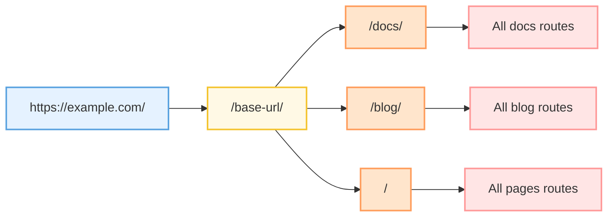

我是个很爱用文字做记录的人，以前看到过很多别人搭建的自己的博客，我也一直有搭个网站来记录些东西的想法，但因为之前技术水平有限始终没有推动落地。直到前几天偶然看到了[环宇哥的博客](https://unaloo.github.io/)，自己研究了一下并向他本人请教了如何实现，发现这事儿能做，那就动手吧。

<!-- truncate -->
整个博客的搭建流程实际上比我想象的又简单又复杂，简单在于，如果只是想把文字记录在博客上做集中整理，那只需要对应框架运行下安装命令开始写文档就可以了；复杂在于，想把自己的博客做的好看实际上还是和前端交互界面设计一样需要自己去手搓一些个性化组件，还有一点是要做网站部署，毕竟博客是要搭出来给别人看的，如果只是给自己看实际上写Word就足够了。下面我会一步一步详细介绍这个博客的搭建历程。

## 框架选择
在自己摸索博客如何搭建的时候，从稀土掘金上大致了解到可以用Hexo、Jekyll、VuePress这些静态站点生成框架来实现博客搭建，而环宇哥自己的博客使用的是VitePress。

### 探索
#### Hexo
[Hexo](https://hexo.io/zh-cn/)是一个基于Node.js的快速、简洁且高效的博客框架，拥有丰富的主题和插件生态系统，适合快速搭建个人博客，部署简单，社区活跃。


#### Jekyll
[Jekyll](https://www.jekyll.com.cn/)是一个基于Ruby的静态网站生成器，是GitHub Pages的默认支持框架。它简单稳定，适合搭建技术博客和项目文档，无需数据库即可运行。


#### VuePress
[VuePress](https://vuepress.vuejs.org/zh/)是一个以Vue.js驱动的静态网站生成器，最初为编写技术文档而生。它对Vue开发者友好，支持在Markdown中使用Vue组件，适合构建文档类网站。


#### VitePress
(VitePress)[https://vitepress.dev/zh/]是VuePress的下一代版本，基于Vite构建，启动速度更快、构建性能更优。它继承了VuePress的优点，同时提供了更现代化的开发体验。


---

但最后以上的技术栈我都没有选择，其实原因很简单，我想找一个能够用React来编写个性化扩展组件的框架（倒不是对Vue有偏见，实际是自己对Vue学的相对较浅，和组里主流的前端学习路线不太一样，从正式进组后一直在主攻React😥），问了下Grok在React生态里有没有和VitePress类似的技术栈，于是他给出了答案————Docusaurus，Vocs，Nextra，Gatsby。


### 考虑
#### Gatsby
Gatsby学习成本过高，GraphQL 是 Gatsby 的核心，但搭建用不到 GraphQL 就直接放弃考虑了；


#### Vocs
Vocs也是基于Vite构建的轻量化框架，是个不错的选择，但国内使用者很少，也没有中文文档，甚至不能在谷歌直接搜索到它的官网；


#### Nextra
其实我很想用Nextra这一套React+Next.js的流程搭建自己的博客，因为我想精进一下Next.js的使用，但它的功能与 Docusaurus 相比要匮乏；


### 最终选择
#### Docusaurus
综合以上种种，我最终选择了Docusaurus，是因为Docusaurus使用基础模板搭建网站，随后进阶功能及插件，可开发高阶的组件进行使用，且社区体系强大，持续在维护，这也是我选择主攻React的一大原因，就是强大的社区生态体系，这一点Docusaurus与React完全吻合。

> Grok：它是 React 生态中**最流行**的选择之一，在 2025 年仍被视为**顶级工具**。

## 初始化
首先确保自己安装了Node，官方建议Node版本在20.0以上，这里推荐用nvm来管理多版本Node，我使用的版本是22.4.1。

在项目存放路径的命令行输入这个命令，会创建一个包含模板文件的新目录。
```bash
npx create-docusaurus@latest your-blog-name classic
```

也可以输入`--typescript`来添加TypeScript支持，这里我选择了TypeScript模板。
```bash
npx create-docusaurus@latest your-blog-name classic --typescript
```
完成项目初始化后，项目结构如下。
```
my-website
├── blog
│   ├── 2019-05-28-hola.md
│   ├── 2019-05-29-hello-world.md
│   └── 2020-05-30-welcome.md
├── docs
│   ├── doc1.md
│   ├── doc2.md
│   ├── doc3.md
│   └── mdx.md
├── src
│   ├── css
│   │   └── custom.css
│   └── pages
│       ├── styles.module.css
│       └── index.ts
├── static
│   └── img
├── docusaurus.config.ts
├── package.json
├── README.md
├── sidebars.ts
└── yarn.lock
```

### 项目结构

#### 核心目录

- **`/blog/`** - 博客文章目录
  - 存放所有博客的 Markdown 文件
  - 如果禁用了博客插件，可以删除该目录，或在配置中通过 `path` 选项修改目录名称

- **`/docs/`** - 文档目录
  - 存放文档的 Markdown 文件
  - 可以在 `sidebars.ts` 中自定义文档侧边栏的顺序
  - 如果禁用了文档插件，可以删除该目录，或通过配置中的 `path` 选项修改目录名称

- **`/src/`** - 非文档文件目录
  - 存放页面或自定义 React 组件等非文档文件
  - 严格来说，你不一定要把非文档文件放在这里，不过把它们放在一个集中的目录，可以让代码检查或处理更为简便

- **`/src/pages`** - 页面目录
  - 该目录中的任何 JSX/TSX/MDX 文件都会被自动转换为网站页面

- **`/static/`** - 静态资源目录
  - 该目录中的所有内容都会被复制到最终 `build` 目录的根目录下
  - 适合存放图片、字体等静态资源文件

#### 配置文件

- **`/docusaurus.config.ts`** - 站点配置文件
  - 包含站点的所有配置信息
  - 这是 Docusaurus v1 中 `siteConfig.ts` 的等效文件
  - 可以配置网站标题、URL、导航栏、页脚、主题等各种选项

- **`/sidebars.ts`** - 侧边栏配置文件
  - 文档使用该文件来指定侧边栏中文档的显示顺序
  - 可以自定义文档的组织结构和层级关系

- **`/package.json`** - 依赖管理文件
  - Docusaurus 网站本质上是一个 React 应用
  - 可以通过 npm 安装和使用任何 npm 包
  - 所有项目依赖都在此文件中声明

### 启动博客
还是在项目的存放路径下，在命令行中依次运行以下命令，即可点击返回的URL(默认为[http://localhost:3000](http://localhost:3000))在本地环境访问初始化后的博客，在初始化过程中，Docusaurus会自动通过npm为你安装初始依赖，依次无需再输入`npm install`命令来安装依赖。
```bash
cd my-website
npm run start
```

>这就是初始化后的博客

## 定制化
### 插件
Docusaurus本身提供了很多功能插件，来实现复杂的交互场景，同时也支持用户可以自己创建自定义插件来实现自身的业务场景，api配置可以参考官方的[plugins](https://www.docusaurus.cn/docs/api/plugins)。

在`docusaurus.config.ts`文件中，找到`plugins`，新增文件目录配置如下就可以在网站自定义example路由实例。
```typescript
plugins: [
    [
      '@docusaurus/plugin-content-docs',
      {
        id: 'example',
        path: 'docs/example',
        routeBasePath: 'example',
        sidebarPath: require.resolve('./sidebars.ts'),
      },
    ],
 ...
]
```

### 路由结构

Docusaurus的路由系统非常灵活，基本路由架构如下：


- **基础 URL (`/base-url/`)**：网站的基础路径，在 `docusaurus.config.ts` 中通过 `baseUrl` 配置
  
- **文档路由 (`/docs/`)**：
  - 对应 `/docs/` 目录下的所有 Markdown 文件
  - 通过 `sidebars.ts` 配置侧边栏结构
  - 适用于系统化的技术文档和教程

- **博客路由 (`/blog/`)**：
  - 对应 `/blog/` 目录下的所有 Markdown 文件
  - 按时间倒序自动排列
  - 支持标签、归档等功能

- **页面路由 (`/`)**：
  - 对应 `/src/pages/` 目录下的 JSX/TSX/MDX 文件
  - 可以创建自定义页面，如首页、关于页面等
  - 文件名即为路由路径

Docusaurus可以自动根据文档结构生成路由，无需手动配置，但如果需要自定义某些路由，例如在顶部导航展示对应文档入口，也支持自定义路由。

在`docusaurus.config.ts`文件中，通过`sidebarPath`引入路由配置，默认如下：
```typescript
const sidebars = {
   //默认
  tutorialSidebar: [{type: 'autogenerated', dirName: '.'}], 
  // By default, Docusaurus generates a sidebar from the docs folder structure
  
  ...
  
  // 自定义配置
  tutorialSidebar: [
    'route1',
    'route2',
    {
      type: 'route3',
      label: '可配置的路由',
      items: ['tutorial-basics/create-a-document'],
    },
    ...
  ],
}
```
### 主题配置
`docusaurus.config.ts`中还可以配置`导航navs`、`底部footer`、`主题色切换`等交互功能，功能非常齐全，通过插件能力还可以引入`全局搜索`功能，这在文档建设时是非常必要的。
```typescript
  // 引入全局搜索插件
  themes: [
    '@docusaurus/theme-live-codeblock',
    [
      require.resolve('@easyops-cn/docusaurus-search-local'),
      {
        indexPages: true,
        hashed: true,
        language: ['en', 'zh'],
        highlightSearchTermsOnTargetPage: true,
        explicitSearchResultPath: true,
      },
    ],
  ],
  
 // 主题配置
themeConfig:
    /** @type {import('@docusaurus/preset-classic').ThemeConfig} */
    ({
      colorMode: {
        defaultMode: 'light', // 默认白昼主题，可配置dark模式
      },
      docs: {
        sidebar: {                             // 侧边栏
          hideable: true,
        },
      },
      announcementBar: {                       // 顶部公告配置
        id: 'notice',
        content: '滚动的公告～',
        backgroundColor: '#2160fd',
        textColor: '#ffffff',
        isCloseable: true,
      },
      navbar: {                               // 顶部导航
        title: 'xxx',
        logo: {                               // logo
          ...
        },
        items: [                              // 顶部路由
         ...
        ],
      },
      footer: {
        links: [
          {
            title: '友情链接',
            items: [
              {
                label: '合作一',
                href: 'https://www.xxx.com',
              },
            ],
          },
             ...
        ],
        ...
      }
      ...
    })
```
### 自定义页面
Docusaurus支持React代码语法来创建页面，可以自行编写例如：首页、轮播、上传文件等功能组件，它也支持开发者主题、插件能力，提供了更好的扩展体验。每个独立页面默认是没有任何样式的，可以添加全局样式`global.css`去配置，当然Docusaurus也像其他React应用一样，支持Tailwind CSS。
```typescript
import React from 'react'
import styles from './styles.module.css'

function BrowserWindow({ children, minHeight, url }) {
  return (
    <div className={styles.browserWindow} style={{ minHeight }}>
      <div className={styles.browserWindowHeader}>
        <div className={styles.buttons}>
          <span className={styles.dot} style={{ background: '#f25f58' }} />
          <span className={styles.dot} style={{ background: '#fbbe3c' }} />
          <span className={styles.dot} style={{ background: '#58cb42' }} />
        </div>
        <div className={styles.browserWindowAddressBar}>{url}</div>
        <div className={styles.browserWindowMenuIcon}>
          <div>
            <span className={styles.bar} />
            <span className={styles.bar} />
            <span className={styles.bar} />
          </div>
        </div>
      </div>

      <div className={styles.browserWindowBody}>{children}</div>
    </div>
  )
}

export default BrowserWindow
```
> 手搓组件

### MarkDown
在Docusaurus中编写MarkDown只要是符合写法规范，Docusaurus会将其自动编译成页面，这一点和编写稀土掘金的文档一样。同时Docusaurus还内置了对[MDX](https://mdxjs.com/)的支持，这意味着我们可以在Markdown文档中编写JSX并将其渲染为React组件。

```mdx
---
id: about
title: 关于我
description: 自我介绍
hide_table_of_contents: true
---

import { Icon } from "@iconify/react";
import Comment from "@site/src/components/Comment";
import social from "@site/data/social";

# 你好 👋，我是嘉星。

- <p className="inline-flex gap-1">
    ⭐全网同名BestStar(嘉星)，头像来自我的机核[机组形象](https://www.gcores.com/users/636802/talks){" "}
    
  </p>
```
### 图标与插图
图标主要来自于[Iconify](https://icon-sets.iconify.design/)和[Simple Icons](https://simpleicons.org/)。


插图主要来着于[unDraw](https://undraw.co/illustrations)


### 小结
这一部分的标题为“定制化”，因为博客界面的搭建风格是比较偏个人，我们可以不管什么插件样式，开箱即用直接开始写博客做记录；也可以用点功夫像做项目一样为它封装样式组件，安装各种插件来提升交互体验。具体定制化实现细节不在此一一赘述，以下是我的`docusaurus.config.ts`全局配置文件，各配置块已用注释说明，可做参考。

<details>
<summary>📝 点击展开查看完整`docusaurus.config.ts`配置代码</summary>

```typescript
import type * as Preset from '@docusaurus/preset-classic'
import type { Config } from '@docusaurus/types'
import { themes } from 'prism-react-renderer'
import social from './data/social'
import type { GiscusConfig } from './src/components/Comment'

const config: Config = {

  title: '嘉星的博客',
  url: 'https://www.beststarli.cn/',
  baseUrl: '/',
  favicon: 'img/beststar.jpg',
  organizationName: 'beststarli',
  projectName: 'beststar-blog',
  // 自定义字段
  customFields: {
    bio: '让行动超越思考',
    description: '欢迎访问我的博客，这是一个基于 Docusaurus 构建的个人博客，主要分享技术文章、项目经验和生活碎碎念。',
  },

  // 启用 Docusaurus v4 新特性
  future: {
    v4: true,
  },

  // 主题配置
  themeConfig: {
    // 社交媒体分享时显示的默认图片
    image: 'img/beststar.jpg',
    // 网站的 meta 标签，用于 SEO 优化
    metadata: [
      {
        name: 'author',
        content: '嘉星',
      },
      {
        name: 'keywords',
        content: '博客, 技术, 生活, 编程, 项目',
      },
    ],
    // 主题模式配置
    // colorMode: {
    //   defaultMode: 'light',
    //   disableSwitch: false,
    //   respectPrefersColorScheme: true,
    // },
    // 文档页面配置
    docs: {
      sidebar: {
        hideable: true,
      },
    },
    // 导航栏配置
    navbar: {
      title: 'BestStar Blog',
      logo: {
        alt: '嘉星',
        src: 'img/beststar.jpg',
        srcDark: 'img/beststar.jpg',
      },
      hideOnScroll: true,
      // 导航栏菜单项
      items: [
        { label: '文档', position: 'right', to: '/docs/intro' },
        { label: '博客', position: 'right', to: 'blog' },
        { label: '项目', position: 'right', to: 'project' },
        { label: '关于', position: 'right', to: 'about' },
        {
          label: '更多',
          position: 'right',
          items: [
            { label: '博客归档', to: 'blog/archive' },
            { label: '友情链接', to: 'friends' },
          ],
        },
      ],
    },
    // 页脚配置
    footer: {
      style: 'dark',
      // 页脚链接分组
      links: [
        {
          title: '学习',
          items: [
            { label: '文档', to: '/docs/intro' },
            { label: '博客', to: 'blog' },
            { label: '项目', to: 'project' },
            { label: '归档', to: 'blog/archive' },
          ],
        },
        {
          title: '社交媒体',
          items: [
            { label: '关于我', to: '/about' },
            { label: 'GitHub', href: social.github.href },
            { label: '稀土掘金', href: social.juejin.href },
            { label: '小红书', href: social.xiaohongshu.href },
          ],
        },
        {
          title: '更多',
          items: [
            { label: '友情链接', position: 'right', to: 'friends' },
            {
              html: `
                <a href="https://docusaurus.io" target="_blank" rel="noreferrer noopener">
                  
                </a>
                `,
            },
            {
              html: `
                <a href="http://geomodeling.njnu.edu.cn/" target="_blank" rel="noreferrer noopener">
                  
                </a>
                `,
            },
          ],
        },
      ],
      // 版权信息
      copyright: `Copyright © ${new Date().getFullYear()} BestStar's Blog. Built with Docusaurus.`,
    },
    // 代码高亮配置
    prism: {
      theme: themes.oneLight,
      darkTheme: themes.oneDark,
      // 额外支持的编程语言
      additionalLanguages: [
        'bash',
        'json',
        'java',
        'python',
        'php',
        'graphql',
        'rust',
        'toml',
        'protobuf',
        'diff',
      ],
      defaultLanguage: 'javascript',

      // 魔法注释：用于在代码块中高亮特定行
      magicComments: [
        {
          className: 'theme-code-block-highlighted-line',
          line: 'highlight-next-line',
          block: { start: 'highlight-start', end: 'highlight-end' },
        },
        {
          className: 'code-block-error-line',
          line: 'This will error',
        },
      ],
    },
    // 目录配置
    tableOfContents: {
      minHeadingLevel: 2,
      maxHeadingLevel: 4,
    },
    // 图片缩放配置
    zoom: {
      selector: '.markdown :not(em) > img',
      background: {
        light: 'rgb(255, 255, 255)',
        dark: 'rgb(50, 50, 50)',
      },
    },
    // Giscus 评论系统配置
    giscus: {
      repo: 'beststarli/beststar-blog',
      repoId: 'R_kgDOQMrJ0Q',
      category: 'General',
      categoryId: 'DIC_kwDOQMrJ0c4CxdDw',
      theme: 'light',
      darkTheme: 'dark_dimmed',
    } satisfies Partial<GiscusConfig>,
    // Mermaid 图表配置
    mermaid: {
      theme: { light: 'neutral', dark: 'dark' },
    },
  } satisfies Preset.ThemeConfig,

  // Markdown 配置
  markdown: {
    mermaid: true,
  },

  // 主题配置
  themes: [
    '@docusaurus/theme-mermaid',
    [
      require.resolve('@easyops-cn/docusaurus-search-local'),
      {
        indexPages: true,
        hashed: true,
        language: ['en', 'zh'],
        highlightSearchTermsOnTargetPage: true,
        explicitSearchResultPath: true,
      },
    ],
  ],

  // 预设配置：使用 Docusaurus 经典主题预设
  presets: [
    [
      'classic',
      {
        // 文档配置
        docs: {
          path: 'docs',
          sidebarPath: './sidebars.ts',
        },
        blog: false,

        // 主题配置
        theme: {
          customCss: ['./src/css/custom.css', './src/css/tweet-theme.css'],
        },

        // 网站地图配置
        sitemap: {
          priority: 0.5,
        },
      } satisfies Preset.Options,
    ],
  ],

  // 插件配置
  plugins: [

    // 图片缩放插件
    'docusaurus-plugin-image-zoom',

    // 自定义博客插件
    [
      './src/plugin/plugin-content-blog',
      {
        path: 'blog',

        // 编辑链接生成函数
        editUrl: ({ locale, blogDirPath, blogPath }) =>
          `https://github.com/beststarli/blog/edit/main/${blogDirPath}/${blogPath}`,

        editLocalizedFiles: false,
        blogDescription: '记录技术成长和生活感悟',
        blogSidebarCount: 10,
        blogSidebarTitle: '最近文章',
        postsPerPage: 12,
        showReadingTime: true,

        // 阅读时间计算函数（按每分钟 300 字计算）
        readingTime: ({ content, frontMatter, defaultReadingTime, locale }) =>
          defaultReadingTime({ content, locale, options: { wordsPerMinute: 300 } }),

        // RSS Feed 配置
        feedOptions: {
          type: 'all',
          title: '嘉星的博客',
          description: '记录技术成长和生活感悟',
        },
      },
    ],
    // Tailwind CSS 插件
    async function tailwindcssPlugin() {
      return {
        name: 'docusaurus-tailwindcss',
        configurePostCss(postcssOptions) {
          postcssOptions.plugins.push(require('tailwindcss'))
          postcssOptions.plugins.push(require('autoprefixer'))
          return postcssOptions
        },
      }
    },
  ],

  // HTML head 标签配置
  headTags: [
    {
      tagName: 'meta',
      attributes: {
        name: 'description',
        content: '我的个人博客',
      },
    },
  ],

  // 外部样式表配置
  stylesheets: [
    'https://cdn.jsdelivr.net/npm/misans@4.0.0/lib/Normal/MiSans-Normal.min.css',
    'https://cdn.jsdelivr.net/npm/misans@4.0.0/lib/Normal/MiSans-Medium.min.css',
    'https://cdn.jsdelivr.net/npm/misans@4.0.0/lib/Normal/MiSans-Semibold.min.css',
  ],

  // 国际化配置
  i18n: {
    defaultLocale: 'zh-CN',
    locales: ['zh-CN'],
  },

  // 断链处理：遇到断链时显示警告而不是报错
  onBrokenLinks: 'warn',
}

export default config

```

</details>

## 代码托管
项目代码托管直接通过GitHub来完成，目的是为了将博客的撰写开发环境与发布生产环境做隔离，也方便下一步的部署操作，方法就是在自己的GitHub创建一个新Repository，具体流程大家应该都清楚，不多赘述。


## 部署
目前的项目部署服务已经几乎脱离了实际的服务器。市面上各大平台都推出了他们自己的前端部署Paas服务，比较知名的有Vercel、Neltify、Github Pages、Cloudflare Pages等等。

### GitHub Pages
刚开始是想直接把博客部署到GitHub Pages，这样直接用GitHub来做服务器，但是由于部署到GitHub Pages要配置GitHub Actions，而GitHub Actions对于GitHub非Pro用户似乎是要收费的，虽然我可以通过学生认证来成为Pro用户，但一直没搞（弄了三次都因为定位问题给我拒了，就懒得弄了）。具体如何部署到GitHub Pages可以参考这篇[文章](https://juejin.cn/post/7334714350899642407?searchId=202511072104204F7F69174AA85CA4B5E4)。


### Vercel
放弃了GitHub Pages部署方案，但我想到了更~~无脑~~简单的方法，直接让Vercel来托管刚刚上传到自己GitHub的代码仓库。

这么做的好处在于不用像GitHub Pages部署那样还需要完善配置文件，只需要点一点即可完成博客部署；而且Vercel可以做到与Github仓库联动，主分支提交更新后自动构建，每次博客更新无需手动打包；另外Vercel会提供一个部署后的网址URL可以直接访问生产环境中的博客。

为方便第一次接触Vercel的同学了解如何实现Vercel与GitHub代码仓库联动，以下是Vercel部署的简单流程示意，在完成Vercel账号注册后可按此流程进行操作。

> 第一步：在`Projects`界面点击`Add New...`菜单中的`Project`选项。


> 第二步：在`Import Git Repository`版块找到要部署的Repository并点击`Import`按钮。


> 第三步：可直接点击`Deploy`按钮完成部署，也可在以上更改相关配置。


> 第四步：看到这个页面就代表部署完成了，可以点击`Continue to Dashboard`来监看部署后博客网站的信息。


> 完成部署

到这里我们已经拿到了部署后博客网站的访问地址，通常为[`your-repository-name.vercel.app`](your-repository-name.vercel.app),可以直接通过此网址来访问我们的博客。

**但是！** 因为众所周知的原因，我们不能通过国内IP像GitHub Pages那样比较流畅的访问Vercel部署的网站，这是Vercel部署的一大痛点，那么要如何实现国内IP访问Vercel呢？

## 域名代理
### 自定义域名
实际上Vercel支持用户自定义域名，这意味着如果我们手中拥有自己的域名，那么就可以和Vercel提供的网址同时绑定在一起，此时我们就需要**赛博大善人**Cloudflare来帮助我们进行域名解析以及CDN服务。

:::note 小知识
Cloudflare的主流服务是域名解析，简单来说就是当我们输入baidu.com的时候来告诉计算机它所指向的IP地址是什么。大善人之处在于这也是一个可以白嫖的网站，因为基础版的域名解析是免费的。虽然免费，但功能却一样不少，甚至更安全更丰富。Cloudflare对域名解析的同时提供代理服务，隐藏真实的ip，保护站点免受非法攻击。

正如之前所说的，我们应用在Vercel部署之后会自动生成一个以vercel.app为后缀的域名，也支持自定义域名。自定义域名可以通过Cloudflare进行域名解析并利用代理服务达到访问Vercel的目的。
:::

因此，我们可以配合Cloudflare的域名解析，以及在国内服务商购买好的域名，我们就可以将Vercel部署的网站的自带域名代理到我们自己的域名，这样就可以在国内访问我们的Vercel应用了。

### 准备域名
既然是要代理Vercel自己提供的域名，那么我们就得准备一个自己在国内服务商购买的域名。我们可以在[腾讯云控制台](https://console.cloud.tencent.com/domain)购买域名，具体操作流程如下，域名价格有高有低，根据自己的需要购买。


> 第一步：在概览界面查询域名，在此输入想要购买的域名并点击`查询域名`按钮


> 第二步：选择合适的域名，点击相应域名的`立即加购`按钮添加购物车，可按需要为域名添加套餐，点击`立即购买`按钮跳转域名注册界面。


> 第三步：按需要为域名配置购买信息，第一次购买需创建信息模板，信息模板的审核平台提示需1-3天，本人实际操作下来个人用户只审核了不到一个小时就通过了。勾选页面下方`同意协议`选项，点击`提交订单`进行支付。


> 第四步：此时回到控制台`我的域名`界面，可以看到我们刚刚购买的域名已经出现了，且服务状态处于`审核中`，我的域名同样审核了不到一个小时就通过了，这样我们就拥有了自己的域名。

### DNS解析与代理

接下来来到[Cloudflare](https://www.cloudflare.com/zh-cn/)，首先完成注册并登录。


> 第一步：在`账户主页`界面，点击`加入域`按钮


> 第二步：填入我们刚刚购买的域名，直接点击`继续`按钮


> 第三步：为域名选择计划，选择`Free`即可。


> 第四步：在接下来的页面，我们拿到了Cloudflare生成的两条DNS，至此Cloudflare的工作暂告一段落。

回到腾讯云控制台，更改DNS服务器解析。


> 第五步：点击购买域名`操作`一栏的`管理`按钮，进入域名管理页面


> 第六步：点击`修改DNS服务器`按钮


> 第七步：选择`使用非腾讯云 DNS`，下方输入我们在Cloudflare得到的两条DNS，点击`提交`按钮完成修改，等待DNS缓存刷新即可。

:::warning 注

部分步骤中出现的`beststarli.top`域名及其DNS仅做演示使用，本人暂未购买该域名。

:::

### 重定向
回到Cloudflare控制台，为生成的两条DNS添加域名解析记录。


> 第一步：在Cloudflare控制台在我们域名后的`更多`菜单点击`配置DNS`选项


> 第二步：点击这两条DNS`编辑`，将`类型`修改为`CNAME`，`名称`为我们购买的域名，可添加`www.`前缀，修改`内容`为Vercel生成的地址`your-repository-name.vercel.app`，开启`Proxy代理`，完成后点击`保存`按钮。

最后回到Vercel中我们部署项目的`DashBoard`界面，为生成的两条DNS添加域名解析记录。


> 第三步：在`DashBoard`界面，点击`Domains`按钮。


> 第四步：在`Domains`界面，点击`Add Domain`按钮。


> 第五步：分别为不带www.前缀的域名和带www.前缀的域名做如上设置，完成后


至此，我们在Vercel部署的网站完成了域名重定向，可以通过国内IP进行访问了。

## 总结

## 参考与鸣谢

- 
- 
- 
- 
- 
- 