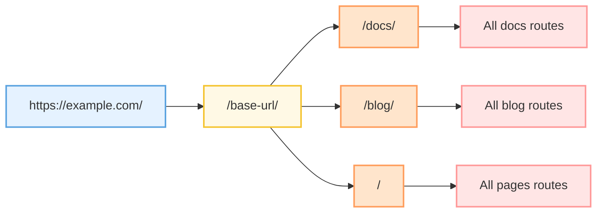

我是个很爱用文字做记录的人，以前看到过很多别人搭建的自己的博客，我也一直有搭个网站来记录些东西的想法，但因为之前技术水平有限始终没有推动落地。直到前几天偶然看到了[环宇哥的博客](https://unaloo.github.io/)，自己研究了一下并向他本人请教了如何实现，发现这事儿能做，那就动手吧。

<!-- truncate -->
整个博客的搭建流程实际上比我想象的又简单又复杂，简单在于，如果只是想把文字记录在博客上做集中整理，那只需要对应框架运行下安装命令开始写文档就可以了；复杂在于，想把自己的博客做的好看实际上还是和前端交互界面设计一样需要自己去手搓一些个性化组件，还有一点是要做网站部署，毕竟博客是要搭出来给别人看的，如果只是给自己看实际上写Word就足够了。下面我会一步一步详细介绍这个博客的搭建历程。

## 框架选择
在自己摸索博客如何搭建的时候，从稀土掘金上大致了解到可以用Hexo、Jekyll、VuePress这些静态站点生成框架来实现博客搭建，而环宇哥自己的博客使用的是VitePress。

### Hexo
[Hexo](https://hexo.io/zh-cn/)是一个基于Node.js的快速、简洁且高效的博客框架，拥有丰富的主题和插件生态系统，适合快速搭建个人博客，部署简单，社区活跃。


### Jekyll
[Jekyll](https://www.jekyll.com.cn/)是一个基于Ruby的静态网站生成器，是GitHub Pages的默认支持框架。它简单稳定，适合搭建技术博客和项目文档，无需数据库即可运行。


### VuePress
[VuePress](https://vuepress.vuejs.org/zh/)是一个以Vue.js驱动的静态网站生成器，最初为编写技术文档而生。它对Vue开发者友好，支持在Markdown中使用Vue组件，适合构建文档类网站。


### VitePress
(VitePress)[https://vitepress.dev/zh/]是VuePress的下一代版本，基于Vite构建，启动速度更快、构建性能更优。它继承了VuePress的优点，同时提供了更现代化的开发体验。


---

但最后以上的技术栈我都没有选择，其实原因很简单，我想找一个能够用React来编写个性化扩展组件的框架（倒不是对Vue有偏见，实际是自己对Vue学的相对较浅，和组里主流的前端学习路线不太一样，从正式进组后一直在主攻React😥），问了下Grok在React生态里有没有和VitePress类似的技术栈，于是他给出了答案————Docusaurus，Vocs，Nextra，Gatsby。


### Gatsby
Gatsby学习成本过高，GraphQL 是 Gatsby 的核心，但搭建用不到 GraphQL 就直接放弃考虑了；


### Vocs
Vocs也是基于Vite构建的轻量化框架，是个不错的选择，但国内使用者很少，也没有中文文档，甚至不能在谷歌直接搜索到它的官网；


### Nextra
其实我很想用Nextra这一套React+Next.js的流程搭建自己的博客，因为我想精进一下Next.js的使用，但它的功能与 Docusaurus 相比要匮乏；


### Docusaurus
最终选择了Docusaurus，是因为Docusaurus使用基础模板搭建网站，随后进阶功能及插件，可开发高阶的组件进行使用，且社区体系强大，持续在维护，这也是我选择主攻React的一大原因，就是强大的社区生态体系，这一点Docusaurus与React完全吻合。


## 初始化
首先确保自己安装了Node，官方建议Node版本在20.0以上，这里推荐用nvm来管理多版本Node，我使用的版本是22.4.1。

在项目存放路径的命令行输入这个命令，会创建一个包含模板文件的新目录。
```bash
npx create-docusaurus@latest your-blog-name classic
```

也可以输入`--typescript`来添加TypeScript支持，这里我选择了TypeScript模板。
```bash
npx create-docusaurus@latest your-blog-name classic --typescript
```
完成项目初始化后，项目结构如下。
```
my-website
├── blog
│   ├── 2019-05-28-hola.md
│   ├── 2019-05-29-hello-world.md
│   └── 2020-05-30-welcome.md
├── docs
│   ├── doc1.md
│   ├── doc2.md
│   ├── doc3.md
│   └── mdx.md
├── src
│   ├── css
│   │   └── custom.css
│   └── pages
│       ├── styles.module.css
│       └── index.ts
├── static
│   └── img
├── docusaurus.config.ts
├── package.json
├── README.md
├── sidebars.ts
└── yarn.lock
```

### 项目结构

#### 📁 核心目录

- **`/blog/`** - 博客文章目录
  - 存放所有博客的 Markdown 文件
  - 如果禁用了博客插件，可以删除该目录，或在配置中通过 `path` 选项修改目录名称

- **`/docs/`** - 文档目录
  - 存放文档的 Markdown 文件
  - 可以在 `sidebars.ts` 中自定义文档侧边栏的顺序
  - 如果禁用了文档插件，可以删除该目录，或通过配置中的 `path` 选项修改目录名称

- **`/src/`** - 非文档文件目录
  - 存放页面或自定义 React 组件等非文档文件
  - 严格来说，你不一定要把非文档文件放在这里，不过把它们放在一个集中的目录，可以让代码检查或处理更为简便

- **`/src/pages`** - 页面目录
  - 该目录中的任何 JSX/TSX/MDX 文件都会被自动转换为网站页面

- **`/static/`** - 静态资源目录
  - 该目录中的所有内容都会被复制到最终 `build` 目录的根目录下
  - 适合存放图片、字体等静态资源文件

#### 📄 配置文件

- **`/docusaurus.config.ts`** - 站点配置文件
  - 包含站点的所有配置信息
  - 这是 Docusaurus v1 中 `siteConfig.ts` 的等效文件
  - 可以配置网站标题、URL、导航栏、页脚、主题等各种选项

- **`/sidebars.ts`** - 侧边栏配置文件
  - 文档使用该文件来指定侧边栏中文档的显示顺序
  - 可以自定义文档的组织结构和层级关系

- **`/package.json`** - 依赖管理文件
  - Docusaurus 网站本质上是一个 React 应用
  - 可以通过 npm 安装和使用任何 npm 包
  - 所有项目依赖都在此文件中声明

### 启动博客
还是在项目的存放路径下，在命令行中依次运行以下命令，即可点击返回的网址IP(默认为[http://localhost:3000](http://localhost:3000))在本地环境访问初始化后的博客，在初始化过程中，Docusaurus会自动通过npm为你安装初始依赖，依次无需再输入`npm install`命令来安装依赖。
```bash
cd my-website
npm run start
```

>这就是初始化后的博客

## 定制化
### 插件
Docusaurus本身提供了很多功能插件，来实现复杂的交互场景，同时也支持用户可以自己创建自定义插件来实现自身的业务场景，api配置可以参考官方的[plugins](https://www.docusaurus.cn/docs/api/plugins)。

在`docusaurus.config.ts`文件中，找到`plugins`，新增文件目录配置如下就可以在网站自定义example路由实例。
```typescript
plugins: [
    [
      '@docusaurus/plugin-content-docs',
      {
        id: 'example',
        path: 'docs/example',
        routeBasePath: 'example',
        sidebarPath: require.resolve('./sidebars.ts'),
      },
    ],
 ...
]
```

### 路由结构

Docusaurus的路由系统非常灵活，基本路由架构如下：


- **基础 URL (`/base-url/`)**：网站的基础路径，在 `docusaurus.config.ts` 中通过 `baseUrl` 配置
  
- **文档路由 (`/docs/`)**：
  - 对应 `/docs/` 目录下的所有 Markdown 文件
  - 通过 `sidebars.ts` 配置侧边栏结构
  - 适用于系统化的技术文档和教程

- **博客路由 (`/blog/`)**：
  - 对应 `/blog/` 目录下的所有 Markdown 文件
  - 按时间倒序自动排列
  - 支持标签、归档等功能

- **页面路由 (`/`)**：
  - 对应 `/src/pages/` 目录下的 JSX/TSX/MDX 文件
  - 可以创建自定义页面，如首页、关于页面等
  - 文件名即为路由路径

Docusaurus可以自动根据文档结构生成路由，无需手动配置，但如果需要自定义某些路由，例如在顶部导航展示对应文档入口，也支持自定义路由。

在`docusaurus.config.ts`文件中，通过`sidebarPath`引入路由配置，默认如下：
```typescript
const sidebars = {
   //默认
  tutorialSidebar: [{type: 'autogenerated', dirName: '.'}], 
  // By default, Docusaurus generates a sidebar from the docs folder structure
  
  ...
  
  // 自定义配置
  tutorialSidebar: [
    'route1',
    'route2',
    {
      type: 'route3',
      label: '可配置的路由',
      items: ['tutorial-basics/create-a-document'],
    },
    ...
  ],
}
```
### 主题配置
`docusaurus.config.ts`中还可以配置`导航navs`、`底部footer`、`主题色切换`等交互功能，功能非常齐全，通过插件能力还可以引入`全局搜索`功能，这在文档建设时是非常必要的。
```typescript


