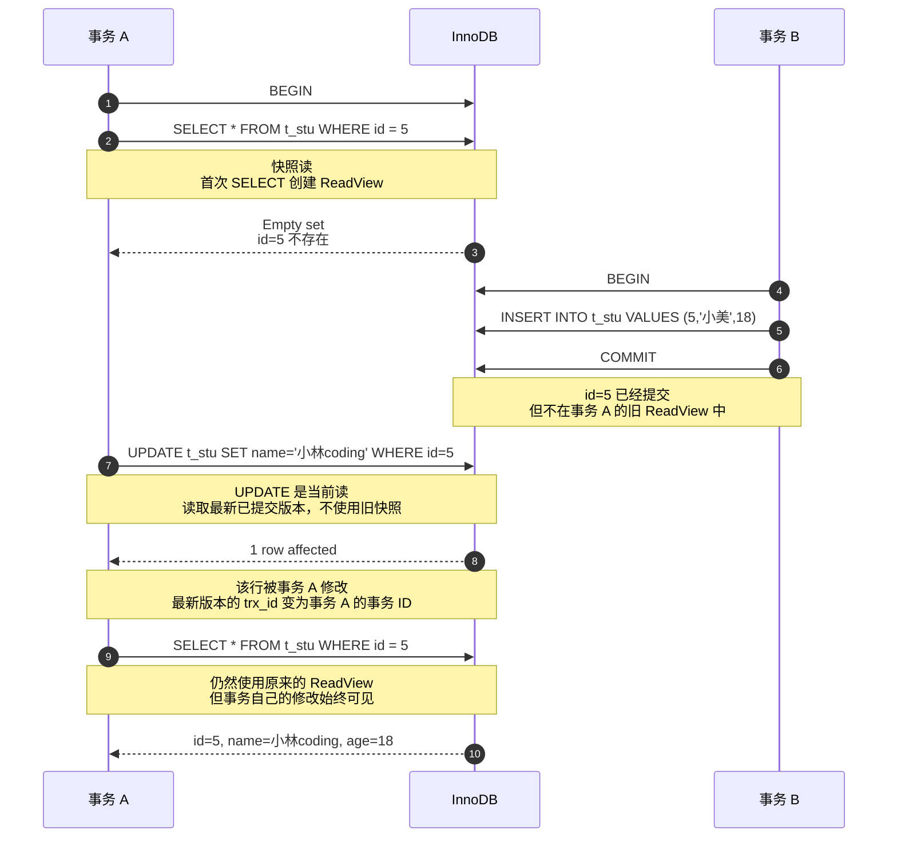

# [MySQL八股](https://www.xiaolincoding.com/interview/mysql.html#sql%E5%9F%BA%E7%A1%80)
## 写在最前
重点需要关注：
- **索引**：B+树的结构、聚簇索引和非聚簇索引的区别、联合索引的最左匹配原则、索引失效的场景，这块是 MySQL 面试里出现频率最高的。
- **事务和MVCC**：四种隔离级别的区别、MVCC是怎么用Read View 来实现可重复读的，这是理解并发问题的核心。
- **锁**：行锁、间隙锁、临键锁各自锁的范围，以及什么情况下会升级成表锁，这块很多人答不清楚。
- **日志**：redo log、undo log、binlog三个日志各自的作用和区别，两阶段提交是怎么保证数据一致性的。

## SQL基础
### NoSQL和SQL的区别
SQL数据库主要指关系型数据库，比如：SQL Server、MySQL、Oracle、PostgreSQL。关系型数据库存储结构化数据，这些数据以行列二维表的形式存在，每一列代表数据的一种属性，每一行代表一个数据实体。

NoSQL指非关系型数据库，比如：MongoDB、Redis。NoSQL数据库逻辑上提供了不同于二维表的存储方式，存储形式可以是JSON文档、哈希表或其他方式。

#### 选择SQL还是NoSQL
需要考虑以下因素：
```txt
ACID还是BASE：关系型数据库支持ACID即原子性、一致性、隔离性、持久性，NoSQL采用更宽松的模型BASE即基本可用、软状态、最终一致性。

对于时机应用场景，需考虑ACID是否必须。比如银行应用应保证ACID，而社交网络应用可以接受BASE。对于需要保证ACID的应用，可以优先考虑SQL，反之则优先考虑NoSQL。
```
- 扩展性
```txt
NoSQL数据之间无关系，这就非常容易扩展，无形中也在架构层面带来了可扩展能力。比如Redis自带主从复制模式、哨兵模式、切片集群模式。

关系型数据库的数据之间则存在关联性、水平扩展较难、需要解决跨服务器的JSON，分布式事务等问题。
```

### 数据库三大范式
#### 第一范式（1NF）
要求数据库的每一列都是不可分割的原子数据项。简单来说就不要存复合信息。

#### 第二范式（2NF）
在第一范式的基础上，非码属性必须完全依赖于候选码。（在第一范式的基础上消除非主属性对主码的部分函数依赖）

第二范式需要确保数据库中的每一列都和主键相关，而不能只与主键的某一部分相关。（主要针对联合主键而言）

#### 第三范式（3NF）
在第三范式的基础上，任何非主属性不依赖于其他非主属性，（在第二范式基础上消除传递依赖）

第三范式需要确保数据表中的每一列数据都和主键直接相关，而不能间接相关。

### MySQL怎么联表查询
数据库主要有以下几种联表查询方式：
- 内连接（INNER JOIN）：交集，返回两表中有匹配关系的行
- 左外连接（LEFT JOIN）：左外连接返回左表中的所有行，及时右表没有匹配的行，未匹配的右表列会包含NULL
- 右外连接（RIGHT JOIN）：右外连接返回右表中的所有行，及时左表没有匹配的行，未匹配的左表列会包含NULL
- 全外连接（FULL JOIN）：并集，全外连接返回两个表中所有行，包括非匹配行，MySQL不支持全外连接，可以通过UNION实现

### MySQL如何避免重复插入数据
#### 使用UNIQUE约束
在表的相关列添加UNIQUE约束，确保每个值在该列中唯一。
#### 使用INSERT ... ON DUPLICATE KEY UPDATE语句
这种语句允许在插入记录时处理重复键的情况，如果插入的记录与现有记录冲突，可以选择更新现有记录，而不是插入新记录。
#### 使用INSERT IGNORE语句
该语句会在插入记录时忽略那些因重复键而导致的插入错误。

#### 选择考量
- 如果需要保证全局唯一性，使用UNIQUE约束是最佳做法
- 如果需要插入和更新结合可以使用INSERT ... ON DUPLICATE KEY UPDATE语句
- 对于快速忽略重复插入，INSERT IGNORE是合适的选择

### CHAR和VARCHAR的区别
- CHAR是固定长度的字符串类型，定义时需要指定固定长度，存储时会在末尾补足空格。CHAR适合存储长度固定的数据，如固定长度的代码、状态等，存储空间固定，对于短字符串效率较高。
- VARCHAR是可变长度的字符串类型，定义时需要指定最大长度，实际存储时根据实际长度占用存储空间。VARCHAR适合存储长度可变的数据，如用户输入的文本、备注等，节约存储空间。

### VARCHAR后面代表字节还是字符
VARCHAR括号内的数字是字符数，而不是字节数。表示的最多可以存储的字符数。字符的字节长度取决于使用的字符集。

### int(1)和int(10)的区别
区别主要在于显示宽度，而不是存储范围或数据类型本身的大小。
- 本质是显示宽度，不改变存储方式：INT存储固定为4字节，所有INT都占用4字节存储空间。括号内的数值是显示宽度，用于在特定场景下控制数值的展示格式。
- 唯一作用场景：ZEROFILL补零显示，当字段设置ZEROFILL时，数字显示会用前导零填充至指定宽度。

### TEXT数据类型可以无限大吗
mysql中3种text类型的最大长度是：
- TEXT：最大长度为65,535字节（约64KB）
- MEDIUMTEXT：最大长度为16,777,215字节（约16MB）
- LONGTEXT：最大长度为4,294,967,295字节（约4GB）

### IP地址如何在数据库中存储
IPv4是一个32位的二进制数，通常以点分十进制表示，例如192.168.2.251
#### 字符串类型存储方式
直接将IP地址作为字符串存储在数据库中，比如可以用VARCHAR(15)类型存储IPv4地址。
- 优点：直观易懂，方便直接进行数据的插入、查询和显示，不需要进行额外的转换。
- 缺点：占用空间较大，字符串比较操作的性能相对较低，不利于进行范围查询。

#### 整数类型存储方式
将IPv4地址转换为32位无符号整数进行存储，常用的数据类型是INT UNSIGNED。
- 优点：节省存储空间，整数比较操作的性能较高，便于进行范围查询。
- 缺点：需要进行额外的转换操作，不够直观，增加了开发的复杂度。

### 外键约束
外键约束的作用是维护表与表之间的关系，确保数据的完整性和一致性。它通过在一个表中引用另一个表的主键或唯一键来实现。确保当前表中的数据在另一个表中存在对应的记录，从而避免出现孤立或无效的数据。

### MySQL的关键字IN和EXISTS
在MySQL中IN和EXISTS都是用来处理子查询的关键词，但是他们在功能、性能和使用场景上各有特点和区别。
#### IN关键字
IN用来检查左边的表达式是否存在于右边的列表或子查询的结果集中。如果存在，则IN返回TRUE，否则返回FALSE。
#### EXISTS关键字
EXISTS用于判断子查询是否至少能返回一行数据。它不关心子查询返回什么数据，只关心是否有结果。如果子查询有结果则EXISTS返回TRUE，否则返回FALSE。

#### 区别与选择
- 性能差异：多数情况下EXISTS的性能优于IN，特别是子查询的表很大时，这是因为EXISTS一旦找到匹配项就会立刻停止查询，而IN可能会需要扫描整个结果集。
- 使用场景：如果子查询结果集较小且不频繁变动，IN可能更直观易懂。而当子查询涉及外部查询的每一行判断，并且子查询的效率较高时，EXISTS可能更适合。
- NULL值处理：IN能够正确处理子查询中包含NULL值的情况，而EXISTS不受子查询结果中NULL值的影响，因为它关注的是行的存在性，而不是具体值。

### MySQL的基本函数
#### 字符串函数
- CONCAT(str1, str2, ...)：用于将多个字符串连接成一个字符串。
- LENGTH(str)：返回字符串str的长度，以字节为单位。
- SUBSTRING(str, pos, len)：从字符串str的指定位置pos开始，提取长度为len的子字符串。
- REPLACE(str, from_str, to_str)：用于将字符串str中的所有from_str子字符串替换为to_str。

#### 数值函数
- ABS(num)：返回num的绝对值。
- POWER(num, exponent)：返回指定数字的指定幂次方。
- NOW()：返回当前的日期和时间。
- CURDATE()：返回当前的日期。

#### 聚合函数
- COUNT(column)：返回指定列的非NULL值的数量。
- SUM(column)：返回指定列的总和。
- AVG(column)：返回指定列的平均值。
- MAX(column)：返回指定列的最大值。
- MIN(column)：返回指定列的最小值。

### SQL查询语句的执行顺序

所有的查询语句都是从FROM开始执行，在执行过程中，每个步骤都会生成一个虚拟表，这个虚拟表将作为下一个执行步骤的输入，最后一个步骤产生的虚拟表即为输出结果。

## 存储引擎
### 执行一条SQL请求的过程
下面是MySQL执行一条SQL查询语句的流程：

- 连接器：建立连接、管理连接、校验用户身份
- 查询缓存：查询语句如果命中查询缓存则直接返回，否则继续往下执行，MySQL 8.0版本已经移除了查询缓存功能。
- 解析SQL，通过解析器对SQL查询语句进行词法分析、语法分析，然后构建语法树，方便后续模块读取表明、字段、语句类型。
- 执行SQL，共三个阶段：
    - 预处理阶段：检查表或字段是否存在；将SELECT * 中的*扩展为表上的所有列
    - 优化阶段：基于查询成本的考虑，选择查询成本最小的执行计划
    - 执行阶段：根据执行计划执行SQL查询语句，从存储引擎读取记录，返回给客户端

### MySQL引擎
- InnoDB：InnoDB是MySQL的默认存储引擎，具有ACID事务支持、行级锁、外键约束等特性。适用于高并发的读写操作，支持较好的数据完整性和并发控制
- MyISAM：MyISAM时MySQL的另一种常见的存储引擎，具有较低的存储空间和内存消耗，适用于大量读操作的场景。然而，MyISAM不支持事务、行级锁和外键约束，因此在并发写入和数据完整性方面有一定的限制。
- Memory：Memory引擎将数据存储在内存中，适用于对性能要求较高的读操作，但是在服务器重启或崩溃时数据会丢失。它不支持事务、行级锁和外键约束。

### MySQL为什么InnoDB是默认引擎
InnoDB在事务支持、并发性能、崩溃恢复等方面具有优势，因此被MySQL选择为默认的存储引擎。
- 事务支持：InnoDB引擎提供了对事务的支持，可以进行ACID属性的操作。MyISAM引擎不支持事务。
- 并发性能：InnoDB引擎采用行级锁定的机制，可以提供更好的并发性能，MyISAM引擎只支持表锁，锁的粒度较大。
- 崩溃恢复：InnoDB引擎通过redo log日志实现了崩溃恢复，可以在数据库发生异常情况时，通过日志文件进行恢复，保证数据的持久性和一致性。MyISAM引擎不支持崩溃恢复。

### MySQL中InnoDB和MyISAM的区别
- 事务：InnoDB支持事务，MyISAM不支持事务，只是MySQL将默认存储引擎从MyISAM更换为InnoDB的重要原因之一。
- 索引结构：InnoDB是聚簇索引，MyISAM是非聚簇索引。聚簇索引的文件存放在主键索引的叶子节点上，因此InnoDB必须要有主键，通过主键索引效率很高。但是辅助索引需要两次查询，先查询到主键，然后再通过主键查询到数据。因此，主键不应该过大，因为主键过大其他索引也都会很大。而MyISAM是非聚簇索引，数据文件是分离的，索引保存的是数据文件的指针。主键索引和辅助索引是独立的。
- 锁粒度：InnoDB最小的锁粒度是行锁，MyISAM最小的锁粒度是表锁，一个更新语句会锁住整张表，导致其他查询和更新都会被阻塞，因此并发访问受限。
- count的效率：InnoDB不保存表的具体行数，通过执行SELECT COUNT(*) FROM TABLE时需要全表扫描。而MyISAM用一个变量保存了整个表的行数，执行上述语句时只需要读出该变量即可，速度很快。

### 数据管理层中数据文件大致分成哪几种数据文件
每创建一个database，都会在/var/lib/mysql/目录中传见一个以database为名的目录，然后保存表结构和表数据的文件都会存放在这个目录里。

假设创建了一个名为test的database，并在其中有一张名为order的表，在/var/lib/mysql/test/目录下会存放该database的表结构文件和表数据文件。
- db.opt：用来存储当前数据库的默认字符集和字符校验规则
- order.frm：order表结构保存在这个文件中，在MySQL中建立一个表就会生成一个.frm文件，该文件用来保存每个表的元数据信息，主要包含表结构定义。
- order.ibd：order表的数据都保存在这个文件中，表数据既可以存在共享表空间文件（ibdata1）中，也可以存在独立的表空间文件（order.ibd）中。这个行为是由参数innodb_file_per_table控制的。如果设置了innodb_file_per_table为1，则会将存储的数据、索引等信息单独存储在一个独占表空间，从MySQL 5.6.6开始这个值默认为1，因此从该版本后默认每张表的数据都存放在一个独立的.ibd文件中。

## 索引
### 索引是什么，有什么好处
索引类似书籍的目录，可以减少扫描的数据量，提高查询效率。
- 如果查询时没有使用索引，全表扫描的时间复杂度就是O(n)
- 如果用到了索引，那么查询时可以基于二分查找，通过索引快速定位目标数据，MySQL索引的数据结构一般是B+树，搜索复杂度为O(log<sub>d</sub>N)，其中d表示节点允许的最大子节点个数。

### 索引的分类
MySQL可以按四个角度来分类索引：
- 数据结构：B+树索引，Hash索引，Full-text索引
- 物理存储：聚簇索引（主键索引）、二级索引（辅助索引）
- 字段特性：主键索引、唯一索引、普通索引、前缀索引
- 字段个数：单列索引、联合索引

#### 数据结构
MySQL常见存储引擎对数据结构分类的索引类型支持情况如下：

InnoDB是MySQL 5.5之后默认的存储引擎，B+树索引类型是MySQL存储引擎采用最多的。

在创建表时，InnoDB存储引擎会根据不同的场景选择不同的列作为索引：
- 如果有主键，默认会使用组件作为聚簇索引的索引键
- 如果没有主键，就选择第一个不包含NULL值的唯一列作为聚簇索引的索引键（key）
- 在上面两个都没有的情况下，InnoDB将自动生成一个隐式自增id列作为聚簇索引的索引键（key）

其他索引都属于辅助索引，也被称为二级索引或非聚簇索引。创建的主键索引和二级索引默认使用的是B+树索引。

#### 物理结构
从物理存储的角度来看，索引分为聚簇索引（主键索引）、二级索引（辅助索引）。二者区别前面也提过了：
- 主键索引的B+树的叶子节点存放的是实际数据，所有完整的用户记录都存放在主键索引的B+树的叶子节点里。
- 二级索引的B+树的叶子节点存放的是主键值，而不是实际数据。

所以在查询时使用了二级索引，如果查询的数据能在二级索引里查询的到，那么就不需要回表，这个过程就是覆盖索引。如果查询的数据不在二级索引里，就会先检索二级索引，找到对应的叶子节点，获取到主键值后，然后再检索主键索引，就能查询到数据了，这个过程就是回表。

#### 字段特性
从字段特性的角度来看，可以分为主键索引、唯一索引、普通索引、前缀索引。
- 主键索引：主键索引就是建立在主键字段上的索引，通常在创建表的时候一起创建，一张表最多只有一个主键索引，索引列的值不允许有空值。
- 唯一索引：唯一索引是建立在UNIQUE字段上的索引，一张表可以有多个唯一索引，索引列的值必须唯一，但是允许有空值。
- 普通索引：普通索引就是建立在普通字段上的索引，既不要求字段为主键，也不要求字段为UNIQUE。
- 前缀索引：前缀索引是指对字符类型字段的前几个字符建立的索引，而不是在整个字段上建立的索引，前缀索引可以建立在字段类型为char、varchar、binary、varbinary的列上。使用前缀索引的目的是为了减少索引占用的存储空间，提升查询效率。

#### 字段个数
从字段个数的角度来看，索引分为单列索引、联合索引（复合索引）。
- 建立在单列上的索引成为单列索引，比如主键索引。
- 建立在多列上的索引称为联合索引。

##### 联合索引
通过将多个字段组合成一个索引，该索引称为联合索引。

联合索引的非叶子节点用两个字段的值作为B+树的key值，当在联合索引查询数据时，先按前面的字段比较，如果相同再按后面的字段比较。因此，使用联合索引时，存在最左匹配原则，按照最左优先的方式进行索引的匹配。在使用联合索引时，如果不遵循「最左匹配原则」，联合索引会失效，这样就无法利用索引快速查询的特性了。

联合索引有一些特殊情况，并不是查询过程使用了联合索引查询，就代表联合索引中的所有字段都用到了联合索引进行索引查询，也就是可能存在部分字段用到联合索引的B+树，部分字段没有用到联合索引的B+树的情况。这种特殊情况就发生在范围查询，联合索引的最左匹配原则会一直向右匹配直到遇到「范围查询」就会停止匹配。也就是范围查询的字段可以用到联合索引，但在范围查询字段的后面的字段无法用到联合索引。

### 哈希索引的使用场景
哈希索引优势是等值查询极快、能直接通过哈希函数定位数据位置，而短板是不支持范围查询、排序和前缀匹配，所以使用场景必须是那些以等值查询为核心，且不需要复杂查询操作的场景。

比如MySQL的Memory存储引擎，默认使用哈希索引。因为内存表本身是基于内存存储的，追求极致的查询速度，而这类场景通常都是简单的等值查询，比如缓存用户登录信息，通过用户ID快速查找对应的登录态、权限信息，这时候哈希索引能直接通过用户ID计算哈希表，定位到数据所在的桶，查询效率接近O(1)，比B+树索引的等值查询更快。

### MySQL聚簇索引和非聚簇索引的区别

- 数据查询：在聚簇索引中，数据行按照索引键值的顺序存储，也就是说，索引的叶子节点包含了实际的数据行。这意味着索引结构本身就是数据的物理存储结构。非聚簇索引的叶子节点不包含完整的数据行，而是包含指向数据行的指针或主键值。数据行本身存储在聚簇索引中。
- 索引与数据关系：由于数据与索引紧密相连，当通过非聚簇索引查找数据时，可以直接从索引中获取数据行，而不需要额外的步骤去查找数据所在的位置。当通过非聚簇索引查找数据时，首先在非聚簇索引中找到对应的主键值，然后通过这个主键值回溯到聚簇索引中查找实际的数据行，这个过程称为“回表”。
- 唯一性：聚簇索引通常是基于主键构建的，因此每个表只能有一个聚簇索引，因为数据只能有一种物理排序方式。一个表可以有多个非聚簇索引，因为他们不直接影响数据的物理存储位置。
- 效率：对于范围查询和排序查询，聚簇索引通常更有效率，因为它避免了额外的寻址开销。非聚簇索引在使用覆盖索引进行查询时效率更高，因为它不需要读取完整的数据行。但是需要进行回表的操作，使用非聚簇索引效率比较低，因为需要进行额外的回表操作。

### 聚簇索引的数据更新，存储会不会变化？
- 如果更新的数据是非索引数据，也就是普通的用户记录，那么存储结构是不会发生变化的。
- 如果更新的数据是索引数据，那么存储结构是有变化的，因为要维护B+树的有序性。

### MySQL主键是聚簇索引吗
在MySQL的InnoDB存储引擎中，主键确实是以聚簇索引的形式存储的。InnoDB将数据存储在B+树结构中，其中主键索引的B+树就是所谓的聚簇索引。这意味着表中的数据行在物理上是按照主键的顺序排列的，聚簇索引的叶子节点包含了实际的数据行。

InnoDB在创建聚簇索引时，会根据不同的场景选择不同的列作为索引：
- 如果有主键，默认使用主键作为聚簇索引的索引键
- 如果没有主键，就选择第一个不包含NULL值的唯一列作为聚簇索引的索引值
- 在以上都不存在时，InnoDB会自动生成一个隐式自增id列作为聚簇索引的索引键。

一张表只能有一个聚簇索引，为了实现非主键字段的快速搜索，就引出了二级索引（非聚簇索引/辅助索引），它也利用了B+树的数据结构，但是二级索引的叶子节点存放的是主键值，不是实际数据。

### 什么字段适合做主键
- 字段具有唯一性，且不允许为空值
- 字段是递增趋势，如果字段的值是随机无序的，可能会引发页分裂的问题，造成性能影响。
- 不建议用业务数据作为主键，因为无法预知未来是否出现相同业务数据的情况，可能导致数据重复和不一致。
- 通常采用自增字段作为主键。因为如果每台机器各自产生的数据需要合并，就可能出现主键重复的问题，这时候就需要考虑分布式id的方案了。

### 性别字段能加索引吗
不推荐，索引创建规则之一是区分度，当数据量巨大时，性别字段的区分度很低，要进行回表操作根据主键找到其他字段，使得索引的效率不高，甚至比全表扫描还慢。

既然索引查询的成本比全表扫描高，这时优化器就会选择全表扫描的方向进行查询，这时建立的性别字段索引就没有起到加快索引的作用了，反而还因为创建索引占据了空间。

### 表中十个字段，主键用自增ID还是UUID？
选用自增ID。因为UUID相对自增ID来说无规律可言，新行主键的值不一定比之前行的值大，所以InnoDB无法做到总是把新行插入到索引的最后，而是需要为新行寻找合适的位置从而分配新的空间。这个过程需要做很多额外操作，数据的毫无顺序会导致数据分布散乱，从而导致：
- 写入的目标页很可能已经刷新到磁盘上并且从缓存上移除，或者还没有被加载到缓存中，InnoDB在插入之前不得不先找到并从磁盘读取目标页到内存中，这将导致大量的随机IO。
- 因为写入是乱序的，InnoDB不得不频繁的做页分裂操作，以便为新的行分配空间，页分裂导致移动大量数据，影响性能。
- 由于频繁的页分裂，页会变得稀疏并被不规则的填充，最终会导致数据有碎片。

综上，使用InnoDB应尽可能按主键的自增顺序插入，并且尽可能使用单调的增加的聚簇键的值来插入新行。

### 为什么自增ID更快，UUID不快吗，它在B+树里面存储是有序的吗
自增的主键的值是有序的，所以InnoDB把每一条记录都存储在一条记录的后面，所以自增id更快的原因是：
- 下一条记录就会写入新的页中，一旦数据按照这种顺序的方式加载，主键页就会近乎于顺序的记录填满，提升了页面的最大填充率，不会有页的浪费。
- 新插入的行一定会在原有的最大数据行下一行，MySQL定位和寻址很快，不会为计算新行的位置而做出额外的消耗。
- 减少了页分裂和碎片的产生

UUID不是自递增的，MySQL中索引的数据结构是B+树，这种数据结构的特点是索引树上的节点的数据是有序的，如果使用UUID作为主键，那么每次插入数据时，无法保证每次生成的UUID有序，就会出现新的UUID需要插入到索引树的中间去，这样可能会频繁地导致页撕裂，使性能下降。

而且UUID占用更大内存，UUID由36个字符组成，在字符串进行比较时，需要从前向后比较，字符串越长性能越差，占用空间也越大。由于页的大小是固定的16KB，这样一页能存放的关键字数量就会越少，最终导致索引树的高度越大，在索引搜索的时候，发生的磁盘IO次数越多，性能越差。

### MySQL中的索引怎么实现的
MySQL的InnoDB引擎使用了B+树作为索引数据结构。B+树是一棵多叉树，叶子节点才存放数据，非叶子节点只存放索引，而且每个节点里的数据是按主键瞬讯存放的。每一层父节点的索引值都会出现在下层子节点的索引值中，因此在叶子节点中，包括了所有的索引值信息，并且每个叶子节点都有两个指针，分别指向下一个叶子节点和上一个叶子节点，形成双向链表。

B+树存储千万级的数据只需要3/4层就可以，这意味着从千万级的表查询目标数据最多需要3/4次磁盘I/O操作，所以B+树相比于B树和二叉树来说，最大的优势在于查询效率很高，因为即使在数据量很大的情况下，查询到一个数据的磁盘I/O依然维持在3/4次。

### 查询数据到达B+树的叶子节点后怎么查找数据
数据页中的记录按照主键顺序组成单向链表，单向链表的特点就是插入、删除非常方便，但是检索效率不高，最差的情况下需要遍历链表上所有节点才能完成检索。

因此数据页中有一个目录页，起到记录的索引作用，为了快速找到记录。页目录与记录的关系：

页目录的创建过程：
1. 将所有的记录划分成几个组，这些记录包括最大记录和最小记录，但不包括标记为“已删除”的记录
2. 每个记录组的最后一条记录就是组内最大的那条记录，并且最后一条记录的头信息中会存储该组一共有多少条记录，作为n_owned字段
3. 页目录用来存储每组最后一条记录的地址偏移量，这些地址偏移量会按照先后顺序存储起来，每组的地址偏移量也被称为槽，每个槽相当于指针指向了不同组的最后一个记录。

页目录就是由多个槽组成的，槽相当于分组记录的索引。因为记录是按照「主键值」从小到大排序的，所以通过槽查找记录时，可以使用二分查找快速定位要查询的记录在哪个槽（记录分组），定位到槽后，再遍历槽内的所有记录，找到对应的记录，无需从最小记录开始遍历整个页中的记录链表。

### B+树的特性
- 所有叶子节点都在同一层：这是B+树的重要特性，确保所有数据项的检索都具有相同的I/O延迟，提高了搜索效率。每个叶子及诶单都包含指向相邻叶子节点的指针，形成链表结构，由于叶子节点之间的链接，B+树非常适合进行范围查询和顺序扫描。可以沿着叶子节点的链表顺序访问数据，而无需进行多次随机访问。
- 非叶子节点存储键值：非叶子节点仅存储键值和指向子节点的指针，不包含数据记录。这些键值用于指导搜索路径，帮助快速定位到正确的叶子节点。并且，由于非叶子节点只存放键值，当数据量比较大时，相比于B树，B+树的层高更少，查找效率也就更高。
- 叶子节点存储数据记录：与B树不同，B+树的叶子节点存储实际的数据记录或指向数据记录的指针。这意味着每次搜索都会到达叶子节点，才能找到所需数据。
- 自平衡：B+树在插入、删除和更新操作后会自动重新平衡，确保树的高度保持相对稳定，从而保持良好的搜索性能。每个节点最多可以有M个子节点，最少可以有M/2个子节点（根节点除外），这里的M是B+树的阶数。阶数就是树种节点的最大子节点数。

### B+树和B树的区别
- 在B+树中，数据都存储在叶子节点中，而非叶子节点只存储索引信息；B树的非叶子节点既存储索引信息也存储部分数据。
- B+树的叶子节点使用链表相连，便于范围查询和顺序访问；B树的叶子节点没有链表连接，范围查询需要回溯到父节点。
- B+树的查找性能更稳定，每次查找都需要查找到叶子节点；B树的查找可能会在非叶子节点找到数据，性能相对不稳定。

### B+树的好处
B树和B+树都是多叉树，这使得整棵树变得矮胖，所以这两个数据结构非常适合检索存于磁盘中的数据。但是MySQL的InnoDB存储引擎默认采用B+树作为索引的数据结构，原因是：
- B+树的非叶子节点不存放实际的数据记录，只存放索引，因此数据量相同的情况下，相比既存数据又存索引的B树，B+树可以存放更多索引，因此B+树比B树更「矮胖」，查询底层节点的磁盘I/O次数更少，查询效率更高。
- B+树有大量的冗余节点（所有的非叶子节点都是冗余索引），这些冗余索引让B+树在插入、删除操作的效率都更高，比如删除根节点的时候，不会像B树那样发生复杂的树的变化。
- B+树叶子节点之间用链表连接，有利于范围索引，而B树要实现范围查询只能通过遍历树来实现，这会涉及多个节点的磁盘I/O操作，范围查询效率不如B+树。

### B+树的叶子节点链表是单向的还是双向的
是双向的，目的是为了实现倒叙遍历和排序。InnoDB使用的B+树有一些特别的点：
- B+树的叶子节点之间是用「双向链表」进行连接，这样既能向右遍历也能向左遍历。
- B+树的叶子节点是数据页，数据页里存放了用户的记录以及各种信息，每个数据页默认大小是16KB。

InnoDB根据索引类型不同，分为聚簇索引和二级索引。他们的区别是，聚簇索引的叶子节点存放的是真实的数据记录，所有完整的用户记录都存放在聚簇索引的叶子节点，而二级索引的叶子节点存放的是主键值，而不是实际数据。

因为表的数据都存放在聚簇索引的叶子节点里，所以InnoDB存储引擎一定会为表创建一个聚簇索引，且由于数据在物理上只存放一份，所以聚簇索引只有一个，而二级索引可以有多个。

### MySQL为什么采用B+树结构，和其他结构相比优点是什么？
- 与B树相比：B+树只在叶子节点存放数据，而B树的非叶子节点也存放数据，所以B+树的单个节点的数据量更小，在相同的磁盘I/O次数下，就能查询到更多节点。另外B+树采用的是双向链表连接，适合MySQL中常见的基于范围的顺序查找，B树做不到这一点。
- 与二叉树相比：对于有N个叶子节点的B+树其搜索复杂度为O(log<sub>d</sub>N)，其中d表示节点允许的最大子节点个数，在实际应用中d是大于100的，这就保证了即使是千万级的数据B+树也可以维持在3-4层左右，只需要做3-4次I/O操作即可查询到目标数据。而二叉树的子节点个数为2，其搜索复杂度为O(log<sub>2</sub>N)，比B+树要高出不少，所用的I/O次数也更多。
- 与Hash相比：Hash在做等值查询时非常快，搜索复杂度是O(1)，但是Hash不适合做范围索引，所以说B+树索引比Hash索引有更广泛的适用场景。

### 为什么MySQL不用跳表
B+树的高度在3层时存放的数据量就可能达到千万级，但对于跳表而言同样去维护千万的数据量所造成的跳表层数过高而导致的磁盘I/O次数过多，B+树在存储同样数据时磁盘I/O次数更少。

### 联合索引的实现原理
将多个字段组合成一个索引，该索引就被称为联合索引。

联合索引用组成索引的字段的值作为B+树的key值，当在联合索引查询数据时，按照「最左匹配原则」进行查询，也就是按照最左优先的方式进行索引匹配。

使用索引的前提是索引中的key是有序的，首字段通常是全局有序的，往后的字段则在前面字段相同时进行排序，保持局部有序而全局无序。

### 创建联合索引需要注意什么
建立联合索引的字段顺序对索引效率有很大影响，越靠前的字段被用来索引过滤的概率更高，实际开发中建立联合索引时，要把区分度大的字段排在前面，这样区分度大的字段越有可能被SQL用到。

区分度就是某个字段column不同值的个数 除以 表的总行数：$$ \text{区分度} = \frac{\text{distinct}(column)}{\text{count}(*)}$$

举例来说，性别字段的区分度就很小，而UUID就适合做排在联合索引靠前位置的字段。因为如果索引的区分度很小，假设字段的值分布均匀，那么无论搜索哪个值都可能得到一半的数据。这种情况下使用索引的意义不大，MySQL有一个查询优化器，当查询优化器发现某个值出现在表的数据行中的百分比超过30%，就会放弃使用索引，直接进行全表扫描。

### 索引失效有哪些
有6种发生索引失效的情况：
- 使用左或者左右模糊匹配的时候，也就是使用了LIKE '%xxx'或者LIKE '%xxx%'的查询方式，这种查询方式会导致索引失效。
- 当在查询条件中对索引列使用函数，就会导致索引失效。
- 当在查询条件中对索引列使用表达式计算，也会导致索引失效。
- MySQL在遇到字符串和数字比较时，会自动把字符串转为数字，然后再进行比较。如果字符串是索引列，而条件语句中的输入参数是数字的话，索引列会发生隐式类型转换，由于隐式类型转换是通过CAST函数实现的，等同于对索引列使用了函数，所以就会导致索引失效。
- 联合索引要能正确使用需要遵循「最左匹配原则」，也就是按最左优先的方式进行索引匹配，否则就会导致索引失效。
- 在WHERE子句中，如果OR连接的条件里有任何一个列没有建立索引，通常就会导致索引失效、走全表扫描（与前后顺序无关）。MySQL 5.1引入了index_merge优化器，当满足条件时优化器可能会对多个索引做合并（UNION、INTERSECT）读取，但并不总是生效，依赖具体数据分布与优化器成本估算。

### 什么情况下会回表查询
从物理存储的角度来看，索引分为聚簇索引（主键索引）、二级索引（辅助索引），他们的区别是：
- 主键索引的B+树的叶子节点存放真实的数据记录。
- 二级索引的B+树的叶子节点存放的是主键值，而不是实际数据。

所以在查询时使用了二级索引，如果查询的数据能在二级索引里查询到，就不需要回表，这个过程就是覆盖索引。如果查询的数据不在二级索引里，就会先检索二级索引找到对应的叶子节点，获取到主键值后再检索主键索引，就能查询到数据了，这个过程就是回表。

### 什么是覆盖索引
覆盖索引是指一个索引包含了查询所需的所有列的数据，因此不需要访问表中的数据行就能完成查询。

换句话说，查询所需的所有数据都能从索引中直接获取，而不需要进行回表查询。覆盖查询可以显著提高查询性能，因为减少了访问数据页的性能，从而减少了I/O操作。

### 如果一个列既是单列索引又是联合索引，查询时会使用哪个索引
MySQL优化器会分析每个索引的查询成本，然后选择成本最低的方案来执行SQL。

### 索引建好后插入一条数据，索引会有哪些变化
插入新数据可能导致B+树结构的调整和索引信息的更新，来保持B+树的平衡和正确性，这些变化通常由数据库自行处理，确保数据的一致性和索引的有效性。

如果插入的数据导致叶子节点已满，可能会触发叶子节点的分裂操作，以保持B+树的平衡性。

### 索引字段是不是越多越好
不是，索引建的越多占用空间越大，而且在写入频繁的场景下，对于B+树的维护所付出的性能消耗也会越大。

### 如果有一个字段是status值为0或者1，适合建立索引吗
不适合，索引字段通常选择区分度较大的字段，status字段只有两个值，区分度很低，查询时可能会返回大量数据，导致索引失效，反而不如全表扫描效率高。

### 索引的优缺点
索引最大的好处是提高查询速度，但是索引也有缺点，比如：
- 典型的用空间换时间，需要占用物理空间，数量越大占用空间越大
- 创建索引和维护索引要消耗时间，这样的时间消耗会随着数据量的增加而增大
- 会降低表的增删改的效率，因为每次增删改索引，B+树为了维护索引有效性，都需要进行动态维护

### 怎么决定建立哪些索引
#### 什么时候适合建立索引
- 字段有唯一性限制
- 经常用于WHERE查询条件的字段，这样可以提高整个表的查询速度，如果查询条件是多个字段，可以建立联合索引
- 经常用于GROUP BY和ORDER BY的字段，这样在查询的时候就不需要去做一次排序了，因为在建立索引后B+树中的记录是有序的

#### 什么时候不需要创建索引
- WHERE条件，GROUP BY，ORDER BY里用不到的字段，索引的价值是快速定位，如果起不到定位的字段通常是不需要创建索引的，因为索引会占用空间，增加维护成本
- 字段中存在大量重复数据，不需要创建索引，比如性别字段。当字段中某值的数量占总数据量的30%以上时，MySQL查询优化器会选择全表扫描而不是使用索引，这样索引就没有意义了
- 表数据太少时，不需要建立索引
- 经常更新的字段不用创建索引，因为索引字段频繁修改，会导致B+树频繁进行页分裂、指针调整等维护操作，不仅影响写入性能，还会产生大量日志和锁开销，得不偿失

### 索引优化
- 前缀索引优化：使用前缀索引是为了减小索引字段大小，可以增加一个索引页中存储的索引值，有效提高索引的查询速度，在一些大字符串的字段作为索引时，使用前缀索引可以帮助我们减小索引项的大小。
- 覆盖索引优化：覆盖索引是指SQL中query的所有字段，在索引B+树的叶子节点就能找得到那些索引，从二级索引中查询得到记录，而不需要通过聚簇索引查询获得，可以避免回表操作。
- 主键索引最好自增：
    - 如果使用自增主键，那么在每次插入新数据时就会按顺序添加到当前索引节点的位置，不需要移动已有数据，当页面写满时，会自动开辟一个新页面，因为每次插入一条新纪录都是追加操作，不需要重新移动数据，因此这种插入数据的方法效率非常高。
    - 如果使用非自增主键，由于每次插入主键的索引值都是随机，在插入新的数据时，就可能会插入到现有数据页的中间位置，这将不得不移动其他数据来满足新数据的插入，甚至需要从一个页面复制数据到另一个页面，这种情况称为页分裂。页分裂会导致大量的内存碎片，使得索引结构不紧凑，从而影响查询效率。
- 防止索引失效：
    - 当使用左或者左右模糊匹配时，即LIKE '%xxx'或者LIKE '%xxx%'的查询方式，会导致索引失效。
    - 查询条件中对索引列做了计算、函数、类型转换操作，会导致索引失效。
    - 联合索引应正确使用「最左匹配原则」，否则会导致索引失效。
    - 在WHERE子句中，如果OR连接的条件里有任何一个列没有建立索引就会导致索引失效、走全表扫描（与前后顺序无关）。

### 前缀索引
前缀索引是为了减小索引字段大小，可以增加一个索引页中存储的索引值，有效提高索引的查询速度。在一些大字符串的字段作为索引时，使用前缀索引可以帮助我们减小索引项的大小。

## 事务
### 事务的特性，如何实现？
- 原子性：一个事务中的所有操作，要么全部完成，要么全部不完成，不回结束在中间某个环节，而且事务在执行过程中发生错误，会被回滚到事务开始前的状态，就像这个事务从来没有执行过一样。
- 一致性：是指事务操作前和操作后，数据满足完整性约束，数据库保持一致性状态。比如两个人之间转账，如果A给B转账100元，那么A的账户就会减少100元，B的账户就会增加100元，这样数据库就保持一致性状态。
- 隔离性：数据库允许多个并发事务同时对其数据进行读写和修改的能力，隔离性可以防止多个事务并发执行时由于交叉执行而导致数据的不一致，因为多个事务同时使用相同的数据时，不会相互干扰，每个事务都有一个完整的数据空间，对其他并发事务是隔离的。
- 持久性：事务处理结束后，对数据的修改是永久的，即使系统故障也不会丢失。

#### MySQL如何保证事务的四个特性
InnoDB引擎通过以下方式保证事务的四个特性：
- 持久性：通过redo log（重做日志）来保证
- 原子性：通过undo log（回滚日志）来保证
- 隔离性：通过MVCC（多版本并发控制）或锁机制来保证
- 一致性：通过持久性+原子性+隔离性来保证

### MySQL可能出现什么并发问题
MySQL服务端允许多个客户端连接，这意味着MySQL会出现同时处理多个事务的情况。那么在同时处理多个事务的时候，就可能出现脏读、不可重复读、幻读问题

#### 脏读
如果一个事务读到了另一个未提交事务修改过的数据，就意味着发生了脏读现象。

假设有 A 和 B 这两个事务同时在处理，事务 A 先开始从数据库中读取小林的余额数据，然后再执行更新操作，如果此时事务 A 还没有提交事务，而此时正好事务 B 也从数据库中读取小林的余额数，那么事务 B 读取到的余额数据是刚才事务 A 更新后的数据，即使没有提交事务。

因为事务 A 是还没提交事务的，也就是它随时可能发生回滚操作，如果在上面这种情况事务 A 发生了回滚，那么事务 B 刚才得到的数据就是过期的数据，这种现象就被称为脏读。

#### 不可重复读
在一个事务中多次读取同一个数据，如果出现前后两次读到的数据不一样的情况，就意味着发生了「不可重复读」现象。

假设有A和B两个事务同时在处理，事务A先开始从数据库中读取小林的余额数据，然后继续执行代码逻辑处理，在这个过程中如果事务B更新了这条数据，并提交了事务，那么当事务A再次读取该数据时，就会发现前后两次读到的数据是不一致的，这种现象称为不可重复读。

#### 幻读
在一个事务内多次查询某个符合查询条件的「记录数量」，如果出现前后两次查询到的记录数量不一样的情况，就意味着发生了「幻读」现象。

假设有A和B这两个事务同时在处理，事务A先开始从数据库查询账户余额大于100万的记录，发现共有5条，然后事务B也按相同的搜索条件也是查询出了5条记录。接下来，事务A插入了一条余额超过100万的账号，并提交了事务，此时数据库超过100万余额的账号个数就变为6。然后事务 B再次查询账户余额大于100万的记录，此时查询到的记录数量有6条，发现和前一次读到的记录数量不一样了，就感觉发生了幻觉一样，这种现象就被称为幻读。

### 哪些场景不适合脏读
脏读是指一个事务在读取到另一个事务未提交的数据时发生。脏读可能会导致不一致的数据被读取，并可能引起问题。
- 银行系统
- 库存管理系统
- 在线订单系统

### MySQL怎么处理并发问题
- 锁机制：MySQL提供了多种锁机制来保证数据的一致性，主要包括行级锁（InnoDB支持）和表级锁（InnoDB和MyISAM支持），页级锁（InnoDB和MyISAM都不支持）。通过锁机制，可以在读写操作时对数据进行加锁，确保同时只有一个操作能够访问或修改数据。
- 事务隔离级别：MySQL提供多种事务隔离级别，包括读未提交、读已提交、可重复读和串行化。通过设置合适的事务隔离级别，可以在多个事务并发执行时，控制事务之间的隔离程度，以避免数据不一致问题。
- MVCC：多版本并发控制，MySQL使用MVCC来管理并发访问，它通过在数据库中保存不同版本的数据来实现不同事务之间的隔离。在读取数据时，MySQL会根据事务的隔离级别来选择合适的数据版本，从而保证数据的一致性。

### 事务的隔离级别有哪些
- 读未提交：指一个事务还未提交时，他做的变更就能被其他事务看到
- 读已提交：指一个事务提交后，他做的变更才能被其他事务看到
- 可重复读：指一个事务执行过程中看到的数据，一直跟这个事务启动时看到的数据是一致的，MySQL InnoDB引擎的默认隔离级别
- 串行化：会对记录加上读写锁，在多个事务对这条记录进行读写操作时，如果发生了读写冲突的时候，后访问的事务必须等前一个事务执行完成，才能继续执行。

按隔离水平高低排序：读未提交 < 读已提交 < 可重复读 < 串行化。针对不同的隔离级别，并发事务时可能发生的现象也会不同。也就是说：
- 在「读未提交」隔离级别下，可能会发生脏读、不可重复读和幻读。
- 在「读已提交」隔离级别下，可能会发生不可重复读和幻读，但不会发生脏读。
- 在「可重复读」隔离级别下，可能会发生幻读，但不会发生脏读和不可重复读。
- 在「串行化」隔离级别下，不会发生脏读、不可重复读和幻读。

#### 四种隔离级别具体如何实现
- 读未提交：因为可以读到未提交事务修改的数据，所以直接读取最新的数据就好了。
- 读已提交、可重复读：通过Read View来实现，区别在于创建Read View的时机不用，「读提交」是在每个语句执行前都会重新生成一个Read View；而「可重复读」是在启动事务时生成一个Read View，然后整个事务期间都使用这个Read View。
- 串行化：通过加读写锁的方式来避免并行访问。

### 可重复读隔离级别下，A事务提交的数据，B事务中能读到吗？
可重复读隔离级别是由MVCC实现的，实现的方式是开始事务后（执行BEGIN语句后），在执行第一个查询语句后，创建一个Read View，后续的查询语句利用这个Read View来，通过这个Read View就可以在undo log版本链中找到事务开始时的数据，所以事务过程中每次查询的数据都是一样的，即使中途有其他事务插入了新纪录，是查询不出来这条数据的。

### 可重复读隔离级别下的幻读问题
可重复读隔离级别下虽然很大程度上避免了幻读，但是没有完全解决幻读。MySQL InnoDB中的MVCC并不能完全避免幻读现象。

事务A在执行时，混用了当前读（SELECT）和快照读（UPDATE），当更新完成后，新数据行称为事务A自己写的数据，于是事务A后续能够看见它，就出现了幻读的情况：


### MySQL设置可重复读隔离级别后怎么保证不发生幻读
尽量在开启事务后，马上执行`SELECT ... FOR UPDATE`这类锁定读的语句，因为他会对记录加next-key锁，从而避免其他事务插入一条新纪录，就避免了幻读问题。

### 串行化隔离级别是通过什么实现的
通过行级锁实现的。在串行化隔离级别下，普通的SELECT查询会对记录加S型的next-key锁，其他事务就没办法对这些已经加锁的记录进行增删改操作了，从而避免了脏读、不可重复读和幻读问题。

### MVCC实现原理
MVCC允许多个事务同时读取同一行数据，而不会彼此阻塞，每个事务看到的数据版本是该事务开始时的数据版本。这意味着如果其他事务在此期间修改了数据，正在运行的事务仍然看到的是它开始时的数据状态，从而实现了非阻塞读操作。

对于「读提交」和「可重复读」隔离级别来说，他们是通过Read View来实现的，他们的区别在于创建Read View的时机不同，Read View就像一个数据快照。
- 读提交：在每个SELECT语句执行前都会重新生成一个Read View。
- 可重复读：执行第一条SELECT时，生成一个Read View，然后整个事务期间都会用这个Read View。

Read View有四个重要的字段：

- m_ids：指的是创建Read View时，当前数据库中活跃事务的事务id列表，注意是个列表，活跃事务是指启动了但还没提交的事务。
- min_trx_id：指的是创建Read View时，当前数据库中活跃事务中事务id最小的事务，也就是m_ids中的最小值。
- max_trx_id：这个并不是m_ids中的最大值，而是创建Read View时当前数据库中应该给下一个事务的id值，也就是全局事务中最大的事务id值+1。
- creator_trx_id：指的是创建该Read View的事务的事务id值。

对于InnoDB存储引擎的数据库表，他的聚簇索引记录中都包含下面两个隐藏列：

- trx_id：当一个事务对某条聚簇索引记录进行改动时，就会把该事务的事务id记录在trx_id隐藏列中
- roll_pointer：每次对某条聚簇索引记录进行改动时，都会把旧版本的记录写入到undo log中，然后这个隐藏列是个指针，指向每一个旧版本记录，于是就可以通过它找到修改前的记录。

在创建Read View后，我们可以将记录中的trx_id划分这三种情况：


一个事务去访问记录的时候，除了自己的更新记录总是可见之外，还有这几种情况：
- 如果记录的trx_id值小于Read View中的min_trx_id值，表示这个版本的记录是在创建Read View之前已经提交的事务生成的，所以该版本的记录对当前事务可见。
- 如果记录的trx_id值大于等于Read View中的max_trx_id值，表示这个版本的记录是在创建Read View之后才启动的事务生成的，所以该版本的记录对当前事务不可见。
- 如果记录的trx_id值在Read View的min_trx_id和max_trx_id之间，那么需要判断trx_id是否在m_ids列表中：
    - 如果记录的trx_id在m_ids列表中，表示生成该版本记录的活跃事务依然活跃着（还没提交事务），所以该版本的记录对当前事务不可见。
    - 如果记录的trx_id不在m_ids列表中，表示生成该版本记录的事务已经提交了，所以该版本的记录对当前事务可见。 

这种通过版本链来控制并发事务访问同一个记录时的行为就叫MVCC（多版本并发控制）。

### 一条UPDATE是不是原子性的
是原子性的，主要通过锁+undo log来保证原子性。
- 执行update的时候，会加行级锁，保证一个事务更新一条记录的时候，不会被其他事务干扰。
- 事务执行过程中，会生成undo log，如果事务执行失败，就可以通过undo log进行回滚。

### 滥用事务或一个事务中多段SQL的弊端
事务的资源在事务提交之后才会释放，比如存储资源、锁。如果一个事务中有特别多的SQL语句，就会带来问题：
- 如果一个事务中的SQL特别多，锁定的数据太多，容易造成大量的死锁和锁超时
- 回滚记录会占用大量存储空间，事务回滚会占用大量存储空间，事务回滚时间长。在MySQL中，实际上每条记录在更新的时候都会记录一条回滚操作。记录上的最新值，通过回滚操作，都可以得到前一个状态的值，SQL越多，需要保存的回滚数据就越多。
- 执行时间长，容易造成主从延迟，主库上必须等事务执行完成才会写入bin log，再传给备库。所以如果一个主库上的语句执行10分钟，那这个事务很可能就会导致从库延迟10分钟。

## 锁
### MySQL有哪些锁
在MySQL中根据加锁范围，可以分为全局锁、表级锁和行锁三类。

- 全局锁：通过FLUSH TABLES WITH READ LOCK语句会将整个数据库设置成只读状态，这时其他线程执行增删改或表结构修改操作都会阻塞。全局锁主要应用于做全库逻辑备份，这样在备份数据库期间，不会因为数据或表结构的更新而出现备份文件的数据与预期的不一样。
- 表级锁：MySQL中的表级锁有以下几种：
    - 表锁：通过lock tables语句可以对表加表锁，表锁除了会限制别的线程的读写外，也会限制本线程接下来的读写操作。
    - 元数据锁：当我们对数据库表进行操作时，会自动给这个表加上MDL，对一张表进行CRUD操作时，加的是MDL读锁；对一张表做结构变更操作的时候，加的是MDL写锁；MDL是为了保证当用户对表执行CRUD操作时，防止其他线程对这个表结构做变更。
    - 意向锁：当执行插入、更新、删除操作，需要先对表加上「意向独占锁」，然后对该记录加独占锁。意向锁的目的是为了快速判断表里是否有记录被加锁。
- 行级锁：InnoDB引擎支持行级锁，而MyISAM不支持行级锁。
- 记录锁：锁住的是一条记录，记录锁有S锁和X锁之分，满足读写互斥、写写互斥。
- 间歇锁：只存在于可重复读隔离级别，目的是为了解决可重复读隔离级别下幻读的现象。
- next-key锁：临键锁，是Record Lock和Gap Lock的组合锁，锁住的是一个范围，并且锁定记录本身。

### 数据库表锁和行锁的作用
#### 表锁的作用
- 整体控制：表锁可以用来控制整个表的并发访问，当一个事务获取了表锁时，其他事务无法对该表做任何读写操作，从而确保数据的一致性和完整性。
- 粒度大：表锁的粒度较大，在锁定表的情况下，可能会影响到整个表的其他操作，可能会引起锁的竞争和性能问题。
- 适用于大批量操作：表锁适合于需要大批量操作表中数据的场景，例如表的重建、大量数据的加载等。

#### 行锁的作用
- 细粒度控制：行锁可以精确控制对表中某行数据的访问，使得其他事务可以同时访问表中的其他行数据，在并发量大的系统中能够提高并发性能。
- 减少锁冲突：行锁不会像表锁那样造成整个表的锁冲突，减少了锁竞争的可能性，提高了并发访问的效率。
- 适用于频繁单行操作：行锁适用于需要频繁对表中单独行进行操作的场景，例如订单系统的增删改等操作。

### MySQL两个线程的UPDATE语句同时处理一条数据会不会阻塞
如果是两个事务同时更新了主键比如id，那么会阻塞，因为InnoDB存储引擎实现了行级锁。

### 两条UPDATE语句处理一张表的不同的主键范围的记录，一个`<10`一个`>15`，会不会遇到阻塞，为什么？
不会，因为锁住的范围不一样，不会形成冲突。
- 第一条UPDATE SQL（`id<10`）在可重复读隔离级别下会以next-key锁的形式锁住`id<10`的范围。
- 第二条UPDATE SQL（`id>15`）在可重复读隔离级别下会以next-key锁的形式锁住`id>15`的范围。

两段范围完全不重叠，因此两个事务不会相互阻塞。

### 如果两个范围不是主键或索引，还会阻塞吗？
如果两个范围查询的字段不是索引的话，那就代表UPDATE没有用到索引，这时会触发全表扫描，全部索引都会加上行级锁，此时第二条UPDATE执行时就会阻塞了。

## 日志
### 日志文件分为哪几种
- redo log重做日志：是InnoDB存储引擎层生成的日志，实现了事务中的持久性，主要用于故障恢复。
- undo log回滚日志：是InnoDB存储引擎层生成的日志，实现了事务中的原子性，主要用于事务回滚和MVCC。
- bin log二进制日志：是Server层生成的日志，主要用于数据备份和主从复制。
- relay log中继日志，用于主从复制场景下，slave通过io线程拷贝master的bin log后本地生成的日志
- 慢查询日志：用于记录执行时间过长的SQL语句，需要设置阈值后手动开启。

### 什么是bin log
MySQL在完成一条更新操作后，Server层还会生成一条bin log，等之后事务提交的时候，会将该事务执行过程中产生的所有bin log统一写入bin log文件，bin log是MySQL的Server层实现的日志，所有存储引擎都可以使用。

bin log是追加写，写满一个文件就创建一个新的文件继续写，不会覆盖以前的日志，保存的是全量的日志，用于备份恢复、主从复制。

bin log文件是记录了所有数据库表结构变更和表数据修改的日志，不会记录查询类的操作，比如SELECT和SHOW操作。

bin log有3种格式类型，分别是STATEMENT、ROW和MIXED：
- STATEMENT：每一条修改数据的SQL都会被记录到bin log中（相当于记录了逻辑操作，所以针对这种格式，bin log可以称为逻辑日志），主从复制中slave端再根据SQL语句重现。但STATEMENT有动态函数问题，比如使用UUID()或NOW()函数时，在主库上执行的结果并不是在从库上执行的结果，这种随机在变的函数会导致复制的数据不一致，这也是MySQL 5.7.7之后将默认格式改为ROW的原因。
- ROW：记录行数据最终被修改成什么样了（这种格式的日志就不能称为逻辑日志了），不会出现STATEMENT下动态函数的问题。但ROW的缺点是每行数据的变化记录都会被记录，比如执行批量UPDATE语句，更新多少行数据就会产生多少条记录，使bin log文件过大，而在STATEMENT格式下只会记录一个UPDATE语句。从MySQL 5.7.7开始，ROW格式是默认的bin log格式。
- MIXED：是STATEMENT和ROW的混合模式，MySQL会根据SQL语句的特性来选择使用STATEMENT还是ROW格式记录bin log。

### undo log的作用
undo log是一种用于撤销回退的日志，它保证了事务ACID特性中的原子性。在事务没有提交之前，MySQL会先记录更新前的数据到undo log日志文件中，当事物回滚时，可以利用undo log来进行回滚。如下图：

每当InnoDB引擎对一条记录进行增删改操作时，要把回滚时需要的信息都记录到undo log中，比如：
- 插入一条记录时，要把这条记录的主键记录下来，这样之后回滚只需要把这个主键值对应的记录删掉就好了
- 删除一条记录时，要把这条记录中的内容都记下来，这样之后回滚时再把由这些内容组成的记录插入回去就好了
- 更新一条记录时，要把被更新的列的旧值记下来，这样之后回滚时再把这些列更新为旧值就好了。

在发生回滚时，就读取undo log中的数据，然后做原先相反操作，比如当DELETE一条记录时，undo log中会把记录中的内容都记下来，然后执行回滚操作的时候，就读取undo log里的数据，然后进行insert操作。

### 有undo log为什么还需要redo log
Buffer Pool的确调高了读写效率，但是Buffer Pool是基于内存的，当发生断电重启时还没落盘的脏页数据就会丢失。为了防止断电导致数据丢失的问题，当有一条记录需要更新的时候，InnoDB引擎就会先更新内存同时标记为脏页，然后将本次对这个页的修改以redo log的形式记录下来，这个时候更新就算完成了。

后续，InnoDB引擎会在适合的时候由后台线程将缓存在Buffer Pool的脏页刷新到磁盘里，这就是WAL（Write Ahead Log）机制。即先写日志再写数据页，这样就算发生断电，InnoDB引擎也可以通过redo log来恢复数据。


redo log是物理日志，记录了某个数据页做了什么修改，每当执行一个事务就会产生这样的一条或者多条物理日志。在事务提交时，只要先将redo log持久化到磁盘即可，可以不需要等到将缓存在Buffer Pool里的脏页数据持久化到磁盘。当系统崩溃时，虽然脏页数据没有持久化，但是redo log已经持久化，接着MySQL重启后，可以根据redo log的内容将所有数据恢复到最新的状态。

redo log和undo log这两种日志是属于InnoDB存储引擎的日志，他们的区别在于：
- redo log记录了此次事务完成后的数据状态，记录的是更新之后的值。
- undo log记录了此次事务开始前的数据状态，记录的是更新之前的值。

事务提交之前发生了崩溃，重启后会通过undo log回滚事务；事务提交之后发生了崩溃，重启后会通过redo log来恢复数据：

所以有了redo log，再通过WAL机制，就可以保证即使数据库发生异常重启，之前已提交的记录都不会丢失，这个能力称为crash-safe崩溃恢复。可以看出，redo log保证了事务ACID中的持久性。

写入redo log的方式使用了追加操作，所以磁盘操作是顺序写；而写入数据需要先找到写入位置，然后才写到磁盘，所以磁盘操作是随机写。磁盘的「顺序写」比「随机写」高效的多，因此redo log写入磁盘的开销更小。这是WAL机制的另一个优点：MySQL的写操作从磁盘的「随机写」变成了「顺序写」，提升语句的执行性能。这时因为MySQL的写操作并不是立刻更新到磁盘上的，而是先记录在日志上，然后在合适的时间再更新到磁盘上。

所以针对为什么还需要redo log这个问题有了两个答案：
- 实现事务的持久性，让MySQL拥有了crash-safe的能力，能够保证MySQL在任何时间段发生崩溃时，重启后之前已提交的记录都不会丢失。
- 将写操作从「随机写」变成了「顺序写」，提升了MySQL写入磁盘的性能。

### redo log怎么保证持久性
redo log是MySQL用于保证持久性的重要机制之一，通过以下方式来保证持久性：
- WAL（Write Ahead Log）机制：在事务提交之前，将事务所做的修改操作记录到redo log中，然后再将数据写入磁盘。这样即使在数据写入磁盘之前发生了宕机，系统可以通过redo log中的记录来恢复数据。
- redo log的顺序写入：redo log采用追加写入的方式，将redo日志记录追加到文件末尾，而不是随机写入。这样可以减少磁盘的随机I/O操作，提高写入性能。
- Checkpoint机制：MySQL会定期将内存中的数据刷新到磁盘，同时将最新的LSN（Log Sequence Number）记录到磁盘中，这个LSN可以确保redo log中的操作是按顺序执行的。在恢复数据时，系统会根据LSN来确定从哪个位置开始应用redo log。

### 能不能只用bin log不用redo log？
不可以，bin log是Server层的日志，没办法记录哪些脏页还没有刷盘，redo log是存储引擎层的日志，可以记录哪些脏页还没有刷盘，这样崩溃恢复的时候，就能恢复那些还没有被刷盘的脏页数据。

### bin log两阶段提交过程是怎样的？
事务提交后，redo log和bin log都要持久化到磁盘，但是这两个是独立的逻辑，可能出现半成功的状态，这样就造成两份日志之间的逻辑不一致。在MySQL的InnoDB存储引擎中，开启bin log的情况下，MySQL会同时维护bin log与InnoDB的redo log，为了保证两个日志的一致性，MySQL使用了内部XA事务，内部XA事务由bin log作为协调者，存储引擎是参与者。

当客户端执行commit语句或者自动提交的情况下，MySQL内部开启一个XA事务，分两阶段完成XA事务的提交：

图中可以看出，事务的提交有两个阶段，就是将redo log的写入拆成两个步骤：prepare和commit，中间再穿插写入bin log，具体过程如下：
- prepare阶段：将XID（内部XA事务的ID）写入到redo log，同时将redo log对应的事务状态设置为prepare，然后将redo log持就到硬盘（innoDB_flush_log_at_trx_commit = 1的作用）
- commit阶段：将XID写入到bin log，然后将bin log持久化到磁盘（sync_binlog = 1的作用），接着调用引擎的提交事务接口，将redo log状态调整为commit，此时该状态并不需要持久化到磁盘，只需要write到文件系统的page cache中就够了，因为只要bin log写磁盘成功，就算redo log的状态还是prepare也没有关系，一样会被认为事务已经执行成功。

#### 以下AB两时刻，MySQL异常重启会出现什么现象？

不管是A时刻（redo log已写入磁盘，bin log还没写入磁盘），还是B时刻（redo log和bin log都已经写入磁盘，还没写入commit标识）发生崩溃，此时的redo log都处于prepare状态。在MySQL重启后会按顺序扫描redo log文件，碰到处于prepare状态的redo log，就拿着redo log中的XID去bin log查看是否存在这个XID：
- 如果bin log中没有当前内部XA事务的XID，说明redo log完成刷盘，但是bin log还没有刷盘，则回滚事务。对应时刻A崩溃恢复的情况。
- 如果bin log中有当前内部XA事务的XID，说明redo log和bin log都完成了刷盘，则提交事务。对应时刻B崩溃恢复的情况。

可以看到，对于处于prepare阶段的redo log，既可以提交事务也可以回滚事务，这取决于是否能在bin log中查找到与redo log相同的XID，这里有就提交事务、没有就回滚事务，这样就可以保证redo log和bin log两份日志的一致性了。所以说两阶段提交是以bin log写成功为事务提交成功的标识，因为bin log写成功了就意味着能在bin log中查找与redo log相同的XID了。

### UPDATE语句的具体执行过程是怎样的
具体更新一条记录`UPDATE t_user SET name = 'xiaolin' WHERE id = 1`的流程如下：
1. 执行器负责具体执行，会调用存储引擎的接口，通过主键索引树搜索获取id = 1这行记录：
    - 如果id = 1这一行所在的数据页本来就在buffer pool中，就直接返回给执行器更新
    - 如果记录不在buffer pool中，将数据页从磁盘读入到buffer pool，返回记录给执行器。
2. 执行器得到聚簇索引记录后，会看一下个更新前的记录和更新后的记录是否一样：
    - 如果一样就不进行后续更新流程
    - 如果不一样就把更新前的记录和更新后的记录都当作参数传给InnoDB层，让InnoDB真正执行更新记录的操作
3. 开启事务，InnoDB层更新记录前，首先要记录相应的undo log，因为这是更新操作，需要吧被更新的列的旧值记录下来，也就是生成一个undo log，undo log会写入buffer pool中的Undo页面，不过在内存修改该Undo页面后，需要记录对应的redo log。
4. InnoDB层开始更新记录，会先更新内存（同时标记为脏页），然后将记录写到redo log中，这个时候更新就完成了。为了减少磁盘I/O，不会立即将脏页写入磁盘，后续由后台线程选择一个合适的时机将脏页写入磁盘，这就是WAL（Write Ahead Log）机制，MySQL的写操作并不是立刻写到磁盘上，而是先写入redo log，再在合适的时间将修改的行数据写到磁盘上。
5. 至此一条记录就更新完了。
6. 有一条更新语句执行完成后，然后开始记录该语句对应的bin log，此时记录的bin log会被保存到binlog cache，并没有刷新到磁盘上的bin log文件，在事务提交时才会统一将该事务运行过程中的所有bin log刷新到磁盘。
7. 事务提交（两阶段提交）：
    - prepare阶段：将redo log对应的事务阶段设置为prepare，然后将redo log刷新到磁盘
    - commit阶段：将bin log刷新到磁盘，接着调用引擎的提交事务接口，将redo log状态设置为commit。
8. 一条更新语句执行完毕。

### MySQL如何保障数据不丢失
主要通过redo log来实现事务持久性，事务执行过程中会把对InnoDB存储引擎中数据页修改操作记录到redo log中，事务提交的时候就直接把redo log刷入磁盘，即使脏页中途没有刷盘成功，MySQL宕机了，也能通过redo log重放，恢复到之前事务修改数据页后的状态，从而保障数据不丢失。

### redo log是在内存中吗？
事务执行过程中，生成的redo log会在redolog buffer中，也就是在内存中，等事务提交的时候再把redo log写入磁盘。

### 为什么要写redo log而不是直接写到B+树里面
因为redo log写入磁盘是顺序写，而B+树中数据页写入磁盘是随机写，顺序写的性能会比随机写好，这样就提高了事务提交的效率。

最重要的是redo log具备故障恢复的能力，redo log记录的是物理级别的修改，包括页的增删改操作，例如在执行一个更新操作时，redo log会记录修改的数据页的地址和更新后的数据，而不是SQL语句本身。在数据页实际更新之前，先将修改操作写入redo log。当数据库重启时，会进行恢复操作。首先，根据redo log检查哪些事务已经提交但数据页尚未完全写入磁盘。然后，使用redo log中的记录对这些事务做重放（Redo）操作，将未完成的数据页修改完成，确保事务的修改生效。

### MySQL的两次写（Double Write Buffer）
常见的服务器是Linux系统，Linux文件系统页的大小默认是4KB，而MySQL的数据页大小默认是16KB。MySQL程序是跑在Linux操作系统上的，需要跟操作系统交互，所以MySQL中一页数据刷入磁盘，要写4个文件系统中的页。

需要注意的是，这个操作并非原子操作，比如在写第二个系统页时如果发生宕机，就会造成“页数据损坏”。这种损坏靠redo日志是无法恢复的。Double Write Buffer的出现就是为了解决这个问题，虽然名字中带有Buffer，但实际上Double Write Buffer是内存+磁盘的机构。

Double Write Buffer的作用是，在把页写到数据文件之前，InnoDB先把他们写到一个叫Double Write Buffer（双写缓冲区）的共享表空间中，在写Double Write Buffer完成后，InnoDB才会把页写到数据文件的适当位置。如果在写页的过程中发生意外崩溃，InnoDB在稍后的恢复过程中在Double Write Buffer中查找完好的page副本用于恢复，本质上是一个最近写回的页面的备份拷贝。

由上图所示，当有页数据要刷盘时：
- 页数据先通过memcpy函数拷贝到内存中的Double Write Buffer中，大小约2MB，Double Write Buffer分为两个区域，每次写入一个区域，每个区域大小约1MB。
- Double Write Buffer的内存中的数据页，会fsync到Double Write Buffer的磁盘上，写两次到共享表空间中（连续存储、顺序写、性能很高），每次写1MB。
- 写入完成后，再将脏页刷到数据磁盘存储.ibd文件上（随机写、性能较低）。

当MySQL出现异常崩溃时，有如下几种情况方式：
1. 步骤一宕机，刷盘未开始，数据在redo log，后期可恢复
2. 步骤一后、步骤二前宕机，因为在内存中，宕机清空内存，和情况1一样
3. 步骤二后、步骤三前宕机，因为Double Write Buffer的磁盘有完整的数据，可以修复损坏的页数据

所以，Double Write Buffer是针对实际的buffer数据页的原子性保证，就是避免MySQL异常崩溃时，写的那几个data page不会出错，要么都写了，要么什么也不做。

#### 为什么redo log无法替代Double Write Buffer？
redo log本质是操作日志，用于MySQL异常崩溃恢复，是InnoDB引擎特有的日志，本质是物理日志，记录的是“在某个数据页做了什么修改”，但如果数据页本身已经发生了损坏，redo log来恢复已经损坏的数据块是无效的，数据块的本身已经损坏，再次Redo重做依然是一个坏块。所以此时需要一个数据块的副本来还原该损坏的数据块，再利用redo log进行其他数据块的Redo重做操作，这就是Double Write Buffer的作用。

## 性能调优
### MySQL的Explain有什么作用
Explain是查看SQL的执行计划的工具，主要用来分析SQL语句的执行过程，比如有没有走索引，有没有外部排序，有没有索引覆盖等等。

对于执行计划，参数有：
- possible_keys：字段表示可能用到的索引
- key：表示实际用的索引，如果这一项为NULL，则说明没有使用索引
- key_len：表示使用索引的长度，越长说明使用的索引越多，效率越高
- rows：表示扫描的行数，越少说明效率越高
- type：表示数据扫描类型，重点关注type的值。
- Extra：表示额外信息，比如是否使用了临时表、是否使用了文件排序等。

#### type字段
type字段就是描述了找到所需数据时使用的扫描方式是什么，常见扫描类型的执行效率从低到高的顺序为：
- ALL：全表扫描，效率最低
- index：全索引扫描，index和all差不多，只不过index对索引表进行全扫码，这样做的好处是不再需要对数据进行排序，但是开销依然很大。应尽量避免全表扫描和全索引扫描。
- range：索引范围扫描，一般在where子句中使用了`<`、`>`、`BETWEEN`、`IN`等操作符时，只检索给定范围的行，属于范围查找。从这一级别开始，索引的作用会越来越明显，因此我们需要尽量让 SQL 查询可以使用到 range 这一级别及以上的 type 访问方式。
- ref：非唯一索引扫描，ref类型表示采用了非唯一索引，或者是唯一索引的非唯一性前缀，返回数据可能返回多条，因为虽然使用了索引，但该索引列的值并不唯一，有重复。这样即使使用索引快速查找到第一条数据，仍然不能停止，要进行目标值范围的小范围扫描。但他的好处是并不需要扫描全表，因为索引是有序的，即使有重复值，也是在一个非常小的范围内扫描。
- eq_ref：唯一索引扫描，eq_ref类型是使用主键或唯一索引时产生的访问方式，通常是用在多表联查中。比如，对两张表进行联查时，关联条件是两张表的user_id相等，且user_id是唯一索引，那么使用EXPLAIN查看执行计划时，type就会显示eq_ref。
- const：结果只有一条的主键或唯一索引扫描，const类型表示使用了主键或唯一索引与常量值进行比较，比如`SELECT name FROM product WHERE id = 1`，需要说明的是const类型和eq_req都使用了主键或唯一索引，不过这两个类型有所区别。const是与常量进行比较，查询效率更快，而eq_ref通常用在多表联查中。

#### Extra字段指标
- Using filesort：当查询语句中包含GROUP BY操作，而且无法利用索引完成排序操作的时候，就不得不选择对应的排序算法进行了，甚至可能会通过文件排序。效率很低，应避免这种情况的发生。
- Using temporary：使用临时表保存中间结果，MySQL在对查询结果排序时使用临时表，常见于排序ORDER BY和分组查询GOURP BY。效率低，要避免这种情况的发生。
- Using index：所需数据只需在索引中就可获取到，不需要再到表中获取数据，也就是使用了覆盖索引，避免了回表操作，效率高。

### 如何看是否有用索引
在SQL语句的前面添加EXPLAIN关键字，执行后会返回一张执行计划表，重点看几个关键字段就可以知道是否有用到索引。比如key和type字段：
- key字段：如果是ref、eq_ref、const，则使用了索引
- key字段：会显示实际使用的索引名称，比如拽呢索引为PRIMARY，如果是NULL则说明没有使用索引，而是全表扫描。

### 怎么看表的索引
最直接的是使用SHOW INDEX命令，能清晰列出表的所有索引信息，包括索引名、索引类型、对应字段、是否主键等。执行后返回多列结果，关键信息很直观：
- Key_name：索引名称，主键索引默认叫PRIMARY
- Column_name：索引对应的字段
- Index_type：索引类型（BTREE、HASH等）
- Non_unique字段为0表示唯一索引（主键索引也是唯一索引），为1表示非唯一索引

如果想更简洁地查看索引名称和对应字段，也可以用SHOW KEYS，它和SHOW INDEX功能完全一致。

MySQL的信息_schema数据库中存储了所有表的元数据，通过查询STATISTICS表能获取更详细的索引信息，适合需要筛选或批量查询的场景，比如查询user表的索引。

### 表查询速度很慢有哪些解决方案
- 分析查询语句：使用EXPLAIN命令分析SQL执行计划，找出慢查询的原因，比如是否使用了全表扫描、是否存在索引未被使用的情况，并根据情况对索引进行适当修改。
- 创建或优化索引：根据查询条件创建合适的索引，特别是经常使用WHERE子句、ORDER BY排序、JOIN连表查询、GROUP BY的字段，并且如果查询中经常涉及多个字段，考虑创建联合索引，使用联合索引应符合最左匹配原则，不然索引会失效。
- 避免索引失效：不要用左模糊匹配、函数计算、表达式计算、类型转换等方式来查询索引字段。
- 查询优化：避免使用SELECT *，只查询真正需要的列；使用覆盖索引，即索引包含所有查询的字段，联表查询最好要以小表驱动大表，并且被驱动的字段要有索引，最好通过冗余字段的设计来避免联表查询。
- 分页优化：针对LIMIT n,y深分页的查询优化，可以把Limit查询转换成某个位置的查询：SELECT * FROM tb_sku WHERE id > 20000 LIMIT
- 优化数据库表
- 使用缓存技术


